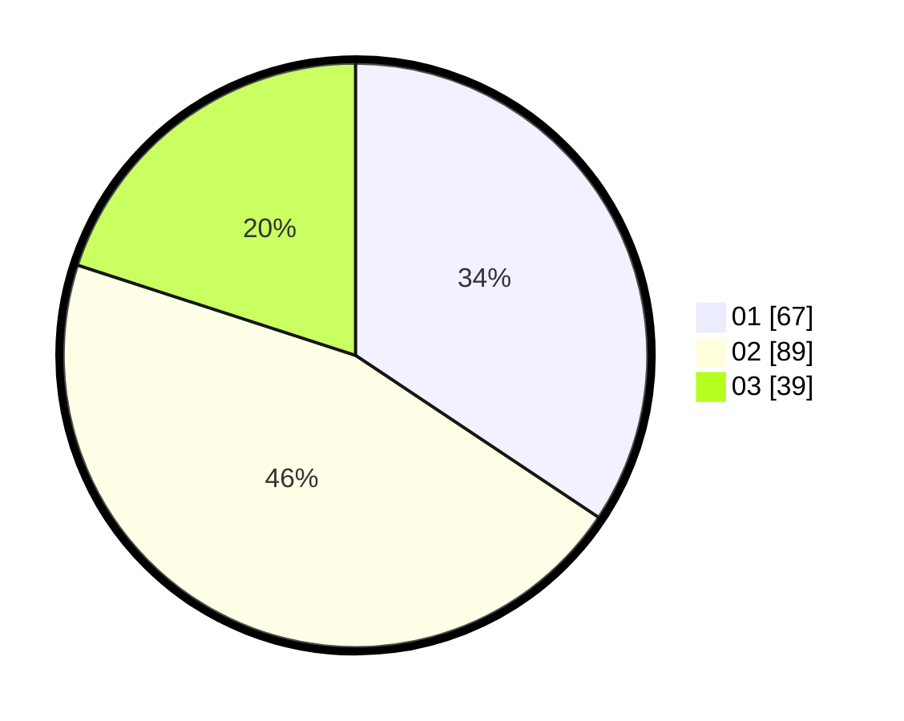

# Hasil

Hasil perolehan suara paslon dapat dilihat pada file paslon-01.txt, paslon-02.txt, dan paslon-03.txt.

Jika tidak ada, artinya data tersebut belum ada pada SIREKAP.

## Perolehan Suara

 * Paslon 01: **67**.
 * Paslon 02: **89**.
 * Paslon 03: **39**.

## Foto C Plano

https://sirekap-obj-formc.kpu.go.id/929d/pemilu/ppwp/31/71/01/10/06/3171011006052-20240214-155035--6b873ba5-a9c0-4085-8c2f-449420188cfe.jpg

https://sirekap-obj-formc.kpu.go.id/929d/pemilu/ppwp/31/71/01/10/06/3171011006052-20240214-155250--c982e67a-d592-452f-a3e8-3b541270c86d.jpg

https://sirekap-obj-formc.kpu.go.id/929d/pemilu/ppwp/31/71/01/10/06/3171011006052-20240214-155451--bbf19885-6fc9-4843-b55f-6c9f41ead3c5.jpg

## DATA PEMILIH TETAP

Jumlah pemilih dalam DPT: **260**.
 * L: **135**.
 * P: **125**.

## DATA PENGGUNA HAK PILIH

Jumlah pengguna hak pilih dalam DPT: **195**.
 * L: **98**.
 * P: **97**.

Jumlah pengguna hak pilih dalam DPTb: **0**.
 * L: **0**.
 * P: **0**.

Jumlah pengguna hak pilih dalam DPK: **1**.
 * L: **1**.
 * P: **0**.

Jumlah pengguna hak pilih: **196**.
 * L: **99**.
 * P: **97**.

## JUMLAH SUARA SAH DAN TIDAK SAH

JUMLAH SELURUH SUARA SAH: **195**.

JUMLAH SUARA TIDAK SAH: **1**.

JUMLAH SELURUH SUARA SAH DAN SUARA TIDAK SAH: **196**.
