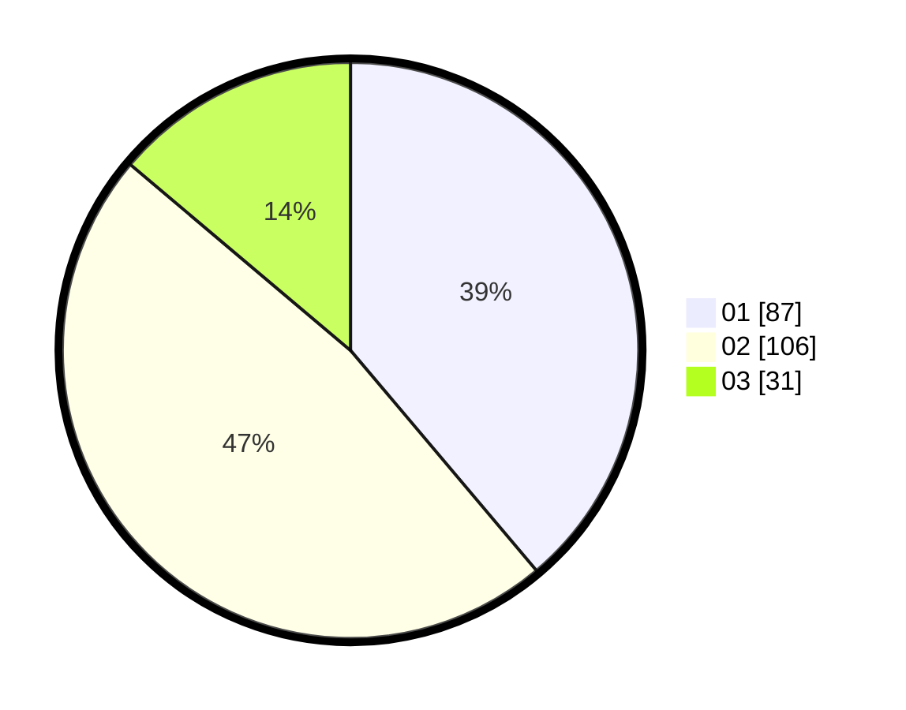

# Hasil

Hasil perolehan suara paslon dapat dilihat pada file paslon-01.txt, paslon-02.txt, dan paslon-03.txt.

Jika tidak ada, artinya data tersebut belum ada pada SIREKAP.

## Perolehan Suara

 * Paslon 01: **87**.
 * Paslon 02: **106**.
 * Paslon 03: **31**.

## Foto C Plano

https://sirekap-obj-formc.kpu.go.id/6bb6/pemilu/ppwp/31/71/01/10/06/3171011006054-20240215-020245--470c59ee-4b6e-4617-99a4-bc99c3c1b83f.jpg

https://sirekap-obj-formc.kpu.go.id/6bb6/pemilu/ppwp/31/71/01/10/06/3171011006054-20240214-190951--b81f65cd-1120-42f6-a5a3-4fcce889487d.jpg

https://sirekap-obj-formc.kpu.go.id/6bb6/pemilu/ppwp/31/71/01/10/06/3171011006054-20240214-191005--22ca45c8-cf99-40b7-8830-dac4f64f5b67.jpg

## DATA PEMILIH TETAP

Jumlah pemilih dalam DPT: **271**.
 * L: **135**.
 * P: **136**.

## DATA PENGGUNA HAK PILIH

Jumlah pengguna hak pilih dalam DPT: **219**.
 * L: **111**.
 * P: **108**.

Jumlah pengguna hak pilih dalam DPTb: **6**.
 * L: **1**.
 * P: **5**.

Jumlah pengguna hak pilih dalam DPK: **0**.
 * L: **0**.
 * P: **0**.

Jumlah pengguna hak pilih: **225**.
 * L: **112**.
 * P: **113**.

## JUMLAH SUARA SAH DAN TIDAK SAH

JUMLAH SELURUH SUARA SAH: **224**.

JUMLAH SUARA TIDAK SAH: **3**.

JUMLAH SELURUH SUARA SAH DAN SUARA TIDAK SAH: **227**.
