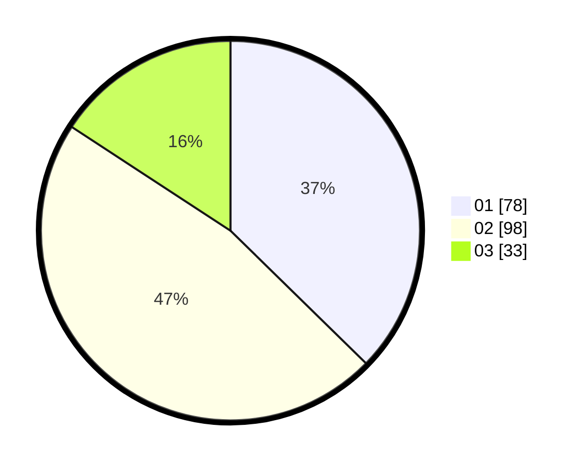

# Hasil

Hasil perolehan suara paslon dapat dilihat pada file paslon-01.txt, paslon-02.txt, dan paslon-03.txt.

Jika tidak ada, artinya data tersebut belum ada pada SIREKAP.

## Perolehan Suara

 * Paslon 01: **78**.
 * Paslon 02: **98**.
 * Paslon 03: **33**.

## Foto C Plano

https://sirekap-obj-formc.kpu.go.id/1d6c/pemilu/ppwp/31/71/01/10/06/3171011006055-20240214-193959--efa872ef-2ffd-427c-8ae3-2d6d87f9d246.jpg

https://sirekap-obj-formc.kpu.go.id/1d6c/pemilu/ppwp/31/71/01/10/06/3171011006055-20240214-202217--61074b79-3a0e-4274-890e-27862c0a2297.jpg

https://sirekap-obj-formc.kpu.go.id/1d6c/pemilu/ppwp/31/71/01/10/06/3171011006055-20240214-193753--ce005e62-db79-4a0d-850a-61fdb69756b1.jpg

## DATA PEMILIH TETAP

Jumlah pemilih dalam DPT: **264**.
 * L: **137**.
 * P: **127**.

## DATA PENGGUNA HAK PILIH

Jumlah pengguna hak pilih dalam DPT: **208**.
 * L: **105**.
 * P: **103**.

Jumlah pengguna hak pilih dalam DPTb: **0**.
 * L: **0**.
 * P: **0**.

Jumlah pengguna hak pilih dalam DPK: **2**.
 * L: **0**.
 * P: **2**.

Jumlah pengguna hak pilih: **210**.
 * L: **105**.
 * P: **105**.

## JUMLAH SUARA SAH DAN TIDAK SAH

JUMLAH SELURUH SUARA SAH: **209**.

JUMLAH SUARA TIDAK SAH: **1**.

JUMLAH SELURUH SUARA SAH DAN SUARA TIDAK SAH: **210**.
