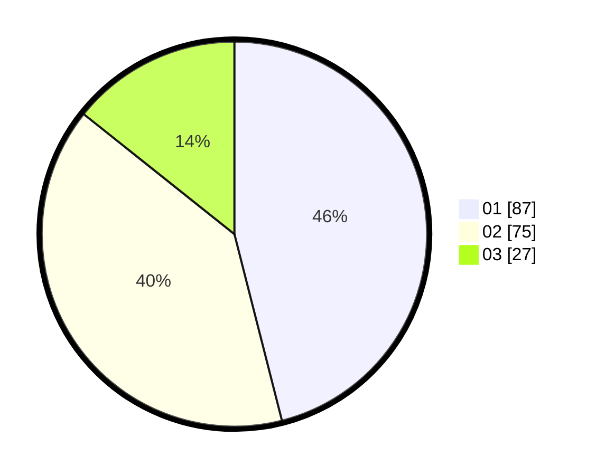

# Hasil

Hasil perolehan suara paslon dapat dilihat pada file paslon-01.txt, paslon-02.txt, dan paslon-03.txt.

Jika tidak ada, artinya data tersebut belum ada pada SIREKAP.

## Perolehan Suara

 * Paslon 01: **87**.
 * Paslon 02: **75**.
 * Paslon 03: **27**.

## Foto C Plano

https://sirekap-obj-formc.kpu.go.id/a7c8/pemilu/ppwp/31/71/01/10/06/3171011006056-20240216-055125--40014fbb-30c0-4e4b-9c94-ccfba8ff92cc.jpg

https://sirekap-obj-formc.kpu.go.id/a7c8/pemilu/ppwp/31/71/01/10/06/3171011006056-20240216-055127--69aa7d73-c442-437b-8354-5406594f4aa1.jpg

https://sirekap-obj-formc.kpu.go.id/a7c8/pemilu/ppwp/31/71/01/10/06/3171011006056-20240216-055126--11d98920-826e-4405-afe2-091a752dd930.jpg

## DATA PEMILIH TETAP

Jumlah pemilih dalam DPT: **261**.
 * L: **125**.
 * P: **136**.

## DATA PENGGUNA HAK PILIH

Jumlah pengguna hak pilih dalam DPT: **190**.
 * L: **88**.
 * P: **102**.

Jumlah pengguna hak pilih dalam DPTb: **1**.
 * L: **1**.
 * P: **0**.

Jumlah pengguna hak pilih dalam DPK: **0**.
 * L: **0**.
 * P: **0**.

Jumlah pengguna hak pilih: **191**.
 * L: **89**.
 * P: **102**.

## JUMLAH SUARA SAH DAN TIDAK SAH

JUMLAH SELURUH SUARA SAH: **189**.

JUMLAH SUARA TIDAK SAH: **2**.

JUMLAH SELURUH SUARA SAH DAN SUARA TIDAK SAH: **191**.
