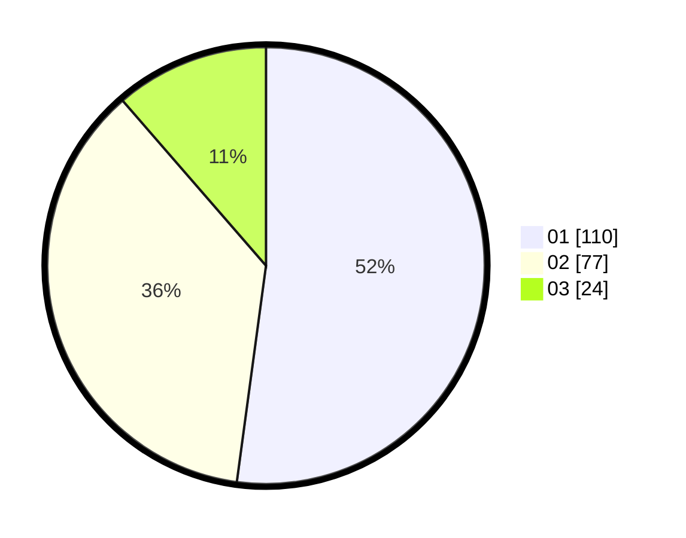

# Hasil

Hasil perolehan suara paslon dapat dilihat pada file paslon-01.txt, paslon-02.txt, dan paslon-03.txt.

Jika tidak ada, artinya data tersebut belum ada pada SIREKAP.

## Perolehan Suara

 * Paslon 01: **110**.
 * Paslon 02: **77**.
 * Paslon 03: **24**.

## Foto C Plano

https://sirekap-obj-formc.kpu.go.id/0b43/pemilu/ppwp/31/71/01/10/06/3171011006058-20240216-121210--db3957b7-dfe5-4cb7-941a-412d1ce9f688.jpg

https://sirekap-obj-formc.kpu.go.id/0b43/pemilu/ppwp/31/71/01/10/06/3171011006058-20240216-121214--a9a2b089-60bb-4f76-b5b6-50c5f2847106.jpg

https://sirekap-obj-formc.kpu.go.id/0b43/pemilu/ppwp/31/71/01/10/06/3171011006058-20240216-121212--df3cc213-96b1-4d10-b4c8-1fd1fbca8d8d.jpg

## DATA PEMILIH TETAP

Jumlah pemilih dalam DPT: **270**.
 * L: **150**.
 * P: **120**.

## DATA PENGGUNA HAK PILIH

Jumlah pengguna hak pilih dalam DPT: **217**.
 * L: **117**.
 * P: **100**.

Jumlah pengguna hak pilih dalam DPTb: **2**.
 * L: **1**.
 * P: **1**.

Jumlah pengguna hak pilih dalam DPK: **0**.
 * L: **0**.
 * P: **0**.

Jumlah pengguna hak pilih: **219**.
 * L: **118**.
 * P: **101**.

## JUMLAH SUARA SAH DAN TIDAK SAH

JUMLAH SELURUH SUARA SAH: **211**.

JUMLAH SUARA TIDAK SAH: **8**.

JUMLAH SELURUH SUARA SAH DAN SUARA TIDAK SAH: **219**.
