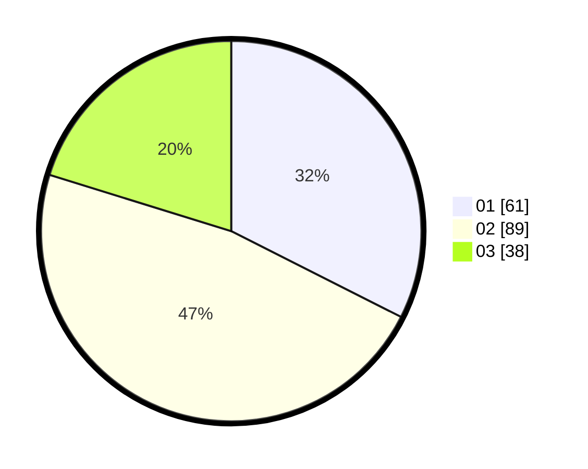

# Hasil

Hasil perolehan suara paslon dapat dilihat pada file paslon-01.txt, paslon-02.txt, dan paslon-03.txt.

Jika tidak ada, artinya data tersebut belum ada pada SIREKAP.

## Perolehan Suara

 * Paslon 01: **61**.
 * Paslon 02: **89**.
 * Paslon 03: **38**.

## Foto C Plano

https://sirekap-obj-formc.kpu.go.id/81c6/pemilu/ppwp/31/71/01/10/06/3171011006063-20240215-025049--7471826a-2951-4590-8cb0-1d37fa7eca56.jpg

https://sirekap-obj-formc.kpu.go.id/81c6/pemilu/ppwp/31/71/01/10/06/3171011006063-20240215-025609--7d17a8b3-989c-498b-a491-2d30413c64b9.jpg

https://sirekap-obj-formc.kpu.go.id/81c6/pemilu/ppwp/31/71/01/10/06/3171011006063-20240215-025522--c54931bc-2513-4f56-80c4-a30157cfb694.jpg
