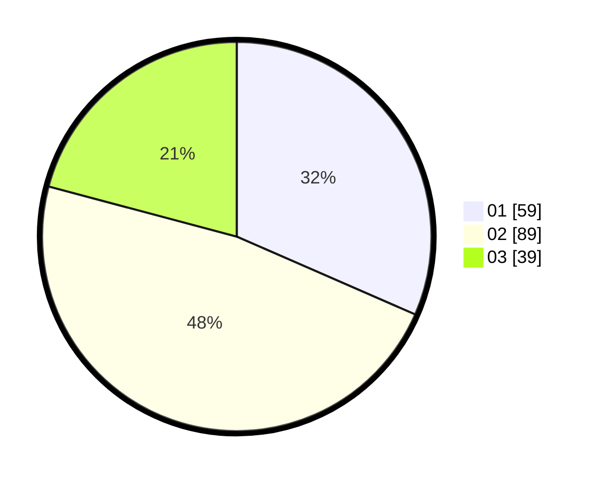

# Hasil

Hasil perolehan suara paslon dapat dilihat pada file paslon-01.txt, paslon-02.txt, dan paslon-03.txt.

Jika tidak ada, artinya data tersebut belum ada pada SIREKAP.

## Perolehan Suara

 * Paslon 01: **59**.
 * Paslon 02: **89**.
 * Paslon 03: **39**.

## Foto C Plano

https://sirekap-obj-formc.kpu.go.id/bca1/pemilu/ppwp/31/71/01/10/06/3171011006067-20240214-182434--a80ae09c-4751-4625-b394-d05df3ca498d.jpg

https://sirekap-obj-formc.kpu.go.id/bca1/pemilu/ppwp/31/71/01/10/06/3171011006067-20240214-194210--42c535eb-4370-4078-bcdd-5e6d58bad507.jpg

https://sirekap-obj-formc.kpu.go.id/bca1/pemilu/ppwp/31/71/01/10/06/3171011006067-20240214-194223--30714973-4d80-4703-b012-cf7957c7a9eb.jpg

## DATA PEMILIH TETAP

Jumlah pemilih dalam DPT: **248**.
 * L: **136**.
 * P: **112**.

## DATA PENGGUNA HAK PILIH

Jumlah pengguna hak pilih dalam DPT: **186**.
 * L: **101**.
 * P: **44**.

Jumlah pengguna hak pilih dalam DPTb: **100**.
 * L: **0**.
 * P: **0**.

Jumlah pengguna hak pilih dalam DPK: **2**.
 * L: **1**.
 * P: **1**.

Jumlah pengguna hak pilih: **188**.
 * L: **102**.
 * P: **85**.

## JUMLAH SUARA SAH DAN TIDAK SAH

JUMLAH SELURUH SUARA SAH: **187**.

JUMLAH SUARA TIDAK SAH: **1**.

JUMLAH SELURUH SUARA SAH DAN SUARA TIDAK SAH: **188**.
