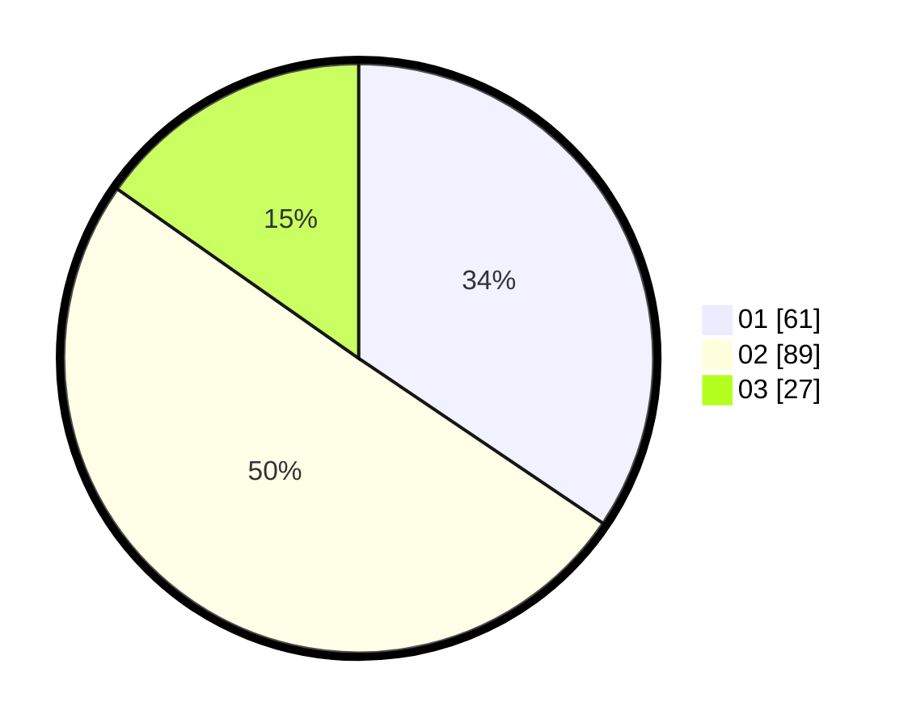

# Hasil

Hasil perolehan suara paslon dapat dilihat pada file paslon-01.txt, paslon-02.txt, dan paslon-03.txt.

Jika tidak ada, artinya data tersebut belum ada pada SIREKAP.

## Perolehan Suara

 * Paslon 01: **61**.
 * Paslon 02: **89**.
 * Paslon 03: **27**.

## Foto C Plano

https://sirekap-obj-formc.kpu.go.id/4f5f/pemilu/ppwp/31/71/01/10/06/3171011006068-20240217-112325--58201fe4-17b6-42fc-8038-b6265591bb84.jpg

https://sirekap-obj-formc.kpu.go.id/4f5f/pemilu/ppwp/31/71/01/10/06/3171011006068-20240217-113236--4d833935-c21b-4a98-939a-ebcbf6f2a70b.jpg

https://sirekap-obj-formc.kpu.go.id/4f5f/pemilu/ppwp/31/71/01/10/06/3171011006068-20240217-113917--9744a24f-8ccf-4ce4-a3c5-22f0eda98b1d.jpg

## DATA PEMILIH TETAP

Jumlah pemilih dalam DPT: **181**.
 * L: **85**.
 * P: **96**.

## DATA PENGGUNA HAK PILIH

Jumlah pengguna hak pilih dalam DPT: **174**.
 * L: **82**.
 * P: **92**.

Jumlah pengguna hak pilih dalam DPTb: **0**.
 * L: **0**.
 * P: **0**.

Jumlah pengguna hak pilih dalam DPK: **7**.
 * L: **3**.
 * P: **4**.

Jumlah pengguna hak pilih: **181**.
 * L: **85**.
 * P: **96**.

## JUMLAH SUARA SAH DAN TIDAK SAH

JUMLAH SELURUH SUARA SAH: **177**.

JUMLAH SUARA TIDAK SAH: **4**.

JUMLAH SELURUH SUARA SAH DAN SUARA TIDAK SAH: **181**.
