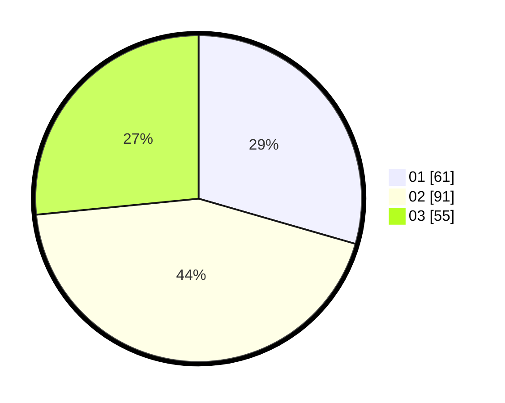

# Hasil

Hasil perolehan suara paslon dapat dilihat pada file paslon-01.txt, paslon-02.txt, dan paslon-03.txt.

Jika tidak ada, artinya data tersebut belum ada pada SIREKAP.

## Perolehan Suara

 * Paslon 01: **61**.
 * Paslon 02: **91**.
 * Paslon 03: **55**.

## Foto C Plano

https://sirekap-obj-formc.kpu.go.id/5ebe/pemilu/ppwp/31/71/02/10/01/3171021001001-20240216-155732--cc0bf066-9c86-418b-ab63-01b4d1e9ae53.jpg

https://sirekap-obj-formc.kpu.go.id/5ebe/pemilu/ppwp/31/71/02/10/01/3171021001001-20240216-155733--27dfac39-0853-4881-a649-9ee98a2f20f0.jpg

https://sirekap-obj-formc.kpu.go.id/5ebe/pemilu/ppwp/31/71/02/10/01/3171021001001-20240216-155732--b0938a3d-4152-4635-9355-36532a9e25d4.jpg

## DATA PEMILIH TETAP

Jumlah pemilih dalam DPT: **0**.
 * L: **0**.
 * P: **0**.

## DATA PENGGUNA HAK PILIH

Jumlah pengguna hak pilih dalam DPT: **0**.
 * L: **0**.
 * P: **0**.

Jumlah pengguna hak pilih dalam DPTb: **0**.
 * L: **0**.
 * P: **0**.

Jumlah pengguna hak pilih dalam DPK: **0**.
 * L: **0**.
 * P: **0**.

Jumlah pengguna hak pilih: **0**.
 * L: **0**.
 * P: **0**.

## JUMLAH SUARA SAH DAN TIDAK SAH

JUMLAH SELURUH SUARA SAH: **207**.

JUMLAH SUARA TIDAK SAH: **4**.

JUMLAH SELURUH SUARA SAH DAN SUARA TIDAK SAH: **211**.
