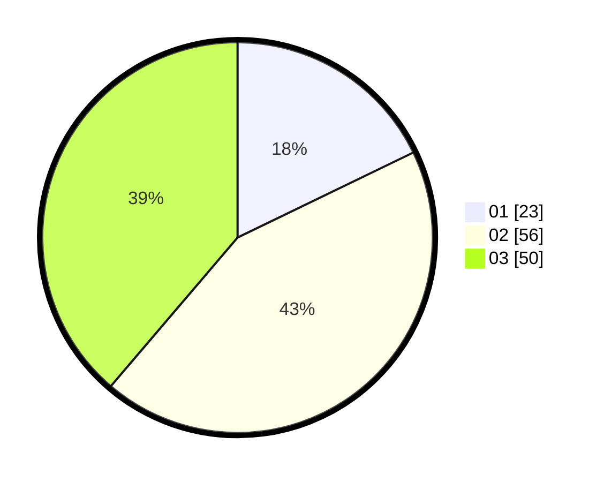

# Hasil

Hasil perolehan suara paslon dapat dilihat pada file paslon-01.txt, paslon-02.txt, dan paslon-03.txt.

Jika tidak ada, artinya data tersebut belum ada pada SIREKAP.

## Perolehan Suara

 * Paslon 01: **23**.
 * Paslon 02: **56**.
 * Paslon 03: **50**.

## Foto C Plano

https://sirekap-obj-formc.kpu.go.id/a2c6/pemilu/ppwp/31/71/02/10/01/3171021001003-20240216-205452--aafca03c-3276-476a-be1a-a49b7f32f4b0.jpg

https://sirekap-obj-formc.kpu.go.id/a2c6/pemilu/ppwp/31/71/02/10/01/3171021001003-20240216-204235--bf1c8ad2-5beb-47ab-bd17-80fd2aa7f194.jpg
