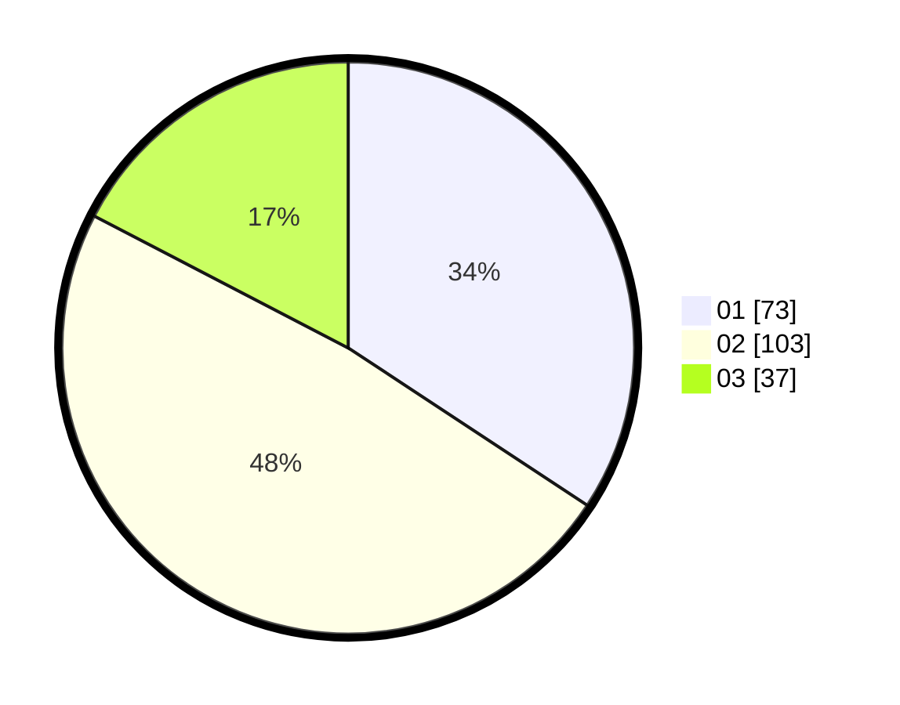

# Hasil

Hasil perolehan suara paslon dapat dilihat pada file paslon-01.txt, paslon-02.txt, dan paslon-03.txt.

Jika tidak ada, artinya data tersebut belum ada pada SIREKAP.

## Perolehan Suara

 * Paslon 01: **73**.
 * Paslon 02: **103**.
 * Paslon 03: **37**.

## Foto C Plano

https://sirekap-obj-formc.kpu.go.id/19eb/pemilu/ppwp/31/71/02/10/01/3171021001007-20240216-173854--d39e4ba3-998b-4a18-9dce-b77a20b875a3.jpg

https://sirekap-obj-formc.kpu.go.id/19eb/pemilu/ppwp/31/71/02/10/01/3171021001007-20240216-173856--60430de5-12ca-4c5b-b316-9ae87405508e.jpg

https://sirekap-obj-formc.kpu.go.id/19eb/pemilu/ppwp/31/71/02/10/01/3171021001007-20240216-173855--17edff4d-9f92-4e1f-9473-72df02d94957.jpg

## DATA PEMILIH TETAP

Jumlah pemilih dalam DPT: **277**.
 * L: **132**.
 * P: **145**.

## DATA PENGGUNA HAK PILIH

Jumlah pengguna hak pilih dalam DPT: **197**.
 * L: **92**.
 * P: **105**.

Jumlah pengguna hak pilih dalam DPTb: **14**.
 * L: **7**.
 * P: **7**.

Jumlah pengguna hak pilih dalam DPK: **4**.
 * L: **1**.
 * P: **3**.

Jumlah pengguna hak pilih: **215**.
 * L: **100**.
 * P: **115**.

## JUMLAH SUARA SAH DAN TIDAK SAH

JUMLAH SELURUH SUARA SAH: **213**.

JUMLAH SUARA TIDAK SAH: **2**.

JUMLAH SELURUH SUARA SAH DAN SUARA TIDAK SAH: **215**.
