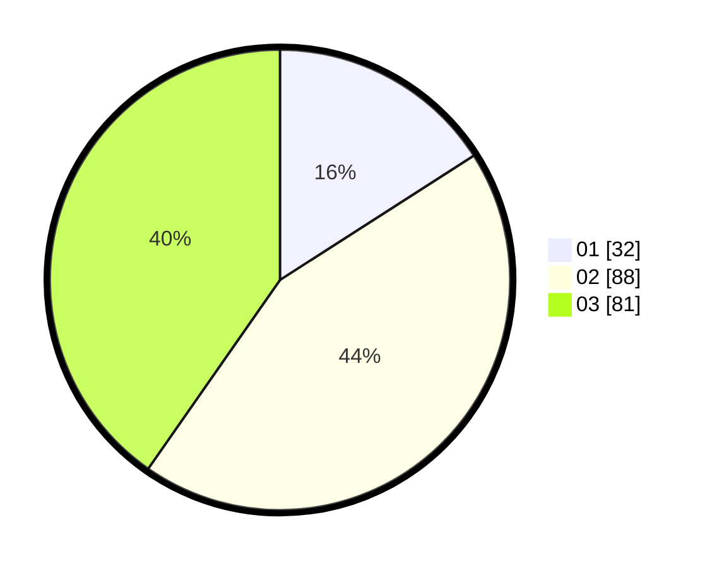

# Hasil

Hasil perolehan suara paslon dapat dilihat pada file paslon-01.txt, paslon-02.txt, dan paslon-03.txt.

Jika tidak ada, artinya data tersebut belum ada pada SIREKAP.

## Perolehan Suara

 * Paslon 01: **32**.
 * Paslon 02: **88**.
 * Paslon 03: **81**.

## Foto C Plano

https://sirekap-obj-formc.kpu.go.id/fc98/pemilu/ppwp/31/71/02/10/01/3171021001008-20240216-160041--d538015c-78d6-43d3-83e7-cf1c27f9c46c.jpg

https://sirekap-obj-formc.kpu.go.id/fc98/pemilu/ppwp/31/71/02/10/01/3171021001008-20240216-160042--160ad7db-c354-4288-a809-84785ee5f678.jpg

https://sirekap-obj-formc.kpu.go.id/fc98/pemilu/ppwp/31/71/02/10/01/3171021001008-20240216-160042--f366f9a3-8b28-4fc9-aea3-da87473a979e.jpg

## DATA PEMILIH TETAP

Jumlah pemilih dalam DPT: **277**.
 * L: **135**.
 * P: **142**.

## DATA PENGGUNA HAK PILIH

Jumlah pengguna hak pilih dalam DPT: **185**.
 * L: **89**.
 * P: **96**.

Jumlah pengguna hak pilih dalam DPTb: **17**.
 * L: **9**.
 * P: **8**.

Jumlah pengguna hak pilih dalam DPK: **2**.
 * L: **0**.
 * P: **2**.

Jumlah pengguna hak pilih: **204**.
 * L: **98**.
 * P: **106**.

## JUMLAH SUARA SAH DAN TIDAK SAH

JUMLAH SELURUH SUARA SAH: **201**.

JUMLAH SUARA TIDAK SAH: **3**.

JUMLAH SELURUH SUARA SAH DAN SUARA TIDAK SAH: **204**.
