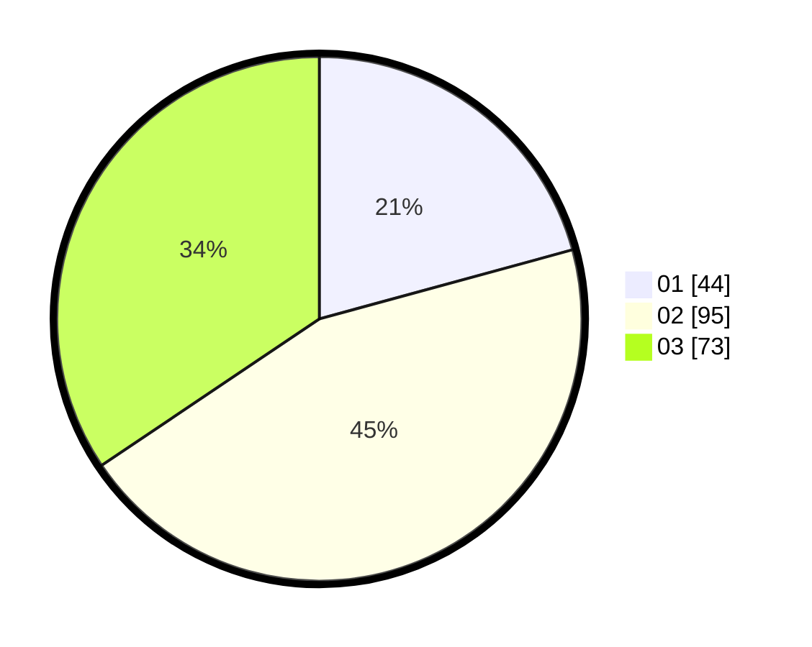

# Hasil

Hasil perolehan suara paslon dapat dilihat pada file paslon-01.txt, paslon-02.txt, dan paslon-03.txt.

Jika tidak ada, artinya data tersebut belum ada pada SIREKAP.

## Perolehan Suara

 * Paslon 01: **44**.
 * Paslon 02: **95**.
 * Paslon 03: **73**.

## Foto C Plano

https://sirekap-obj-formc.kpu.go.id/8b23/pemilu/ppwp/31/71/02/10/01/3171021001009-20240214-155125--de962da4-be7f-4bee-9141-801460c66cbe.jpg

https://sirekap-obj-formc.kpu.go.id/8b23/pemilu/ppwp/31/71/02/10/01/3171021001009-20240214-155229--9d027d0a-bfba-46aa-ad97-30721c598457.jpg

https://sirekap-obj-formc.kpu.go.id/8b23/pemilu/ppwp/31/71/02/10/01/3171021001009-20240214-155331--3de299ce-c31f-4af4-b37c-03a95dd3c273.jpg

## DATA PEMILIH TETAP

Jumlah pemilih dalam DPT: **270**.
 * L: **137**.
 * P: **133**.

## DATA PENGGUNA HAK PILIH

Jumlah pengguna hak pilih dalam DPT: **196**.
 * L: **99**.
 * P: **97**.

Jumlah pengguna hak pilih dalam DPTb: **16**.
 * L: **3**.
 * P: **13**.

Jumlah pengguna hak pilih dalam DPK: **5**.
 * L: **1**.
 * P: **4**.

Jumlah pengguna hak pilih: **217**.
 * L: **103**.
 * P: **114**.

## JUMLAH SUARA SAH DAN TIDAK SAH

JUMLAH SELURUH SUARA SAH: **212**.

JUMLAH SUARA TIDAK SAH: **5**.

JUMLAH SELURUH SUARA SAH DAN SUARA TIDAK SAH: **217**.
