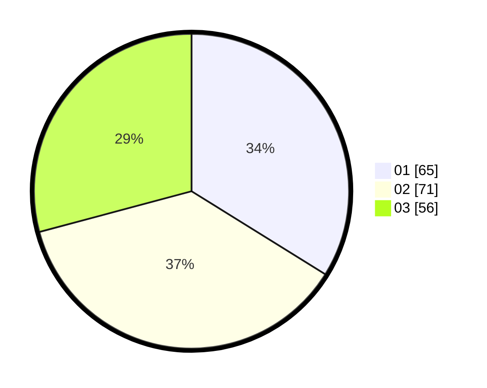

# Hasil

Hasil perolehan suara paslon dapat dilihat pada file paslon-01.txt, paslon-02.txt, dan paslon-03.txt.

Jika tidak ada, artinya data tersebut belum ada pada SIREKAP.

## Perolehan Suara

 * Paslon 01: **65**.
 * Paslon 02: **71**.
 * Paslon 03: **56**.

## Foto C Plano

https://sirekap-obj-formc.kpu.go.id/6a4b/pemilu/ppwp/31/71/02/10/01/3171021001011-20240217-170337--3d273fe5-c37b-4d56-87dd-6e29be16c4c8.jpg

https://sirekap-obj-formc.kpu.go.id/6a4b/pemilu/ppwp/31/71/02/10/01/3171021001011-20240217-170338--b517f9e9-4a0c-40c7-8ef7-2e5ac5610df8.jpg

https://sirekap-obj-formc.kpu.go.id/6a4b/pemilu/ppwp/31/71/02/10/01/3171021001011-20240217-170338--6b883494-f205-4cf3-ae57-55b387a60345.jpg

## DATA PEMILIH TETAP

Jumlah pemilih dalam DPT: **280**.
 * L: **135**.
 * P: **145**.

## DATA PENGGUNA HAK PILIH

Jumlah pengguna hak pilih dalam DPT: **182**.
 * L: **81**.
 * P: **101**.

Jumlah pengguna hak pilih dalam DPTb: **12**.
 * L: **8**.
 * P: **4**.

Jumlah pengguna hak pilih dalam DPK: **1**.
 * L: **1**.
 * P: **0**.

Jumlah pengguna hak pilih: **195**.
 * L: **90**.
 * P: **105**.

## JUMLAH SUARA SAH DAN TIDAK SAH

JUMLAH SELURUH SUARA SAH: **192**.

JUMLAH SUARA TIDAK SAH: **3**.

JUMLAH SELURUH SUARA SAH DAN SUARA TIDAK SAH: **195**.
