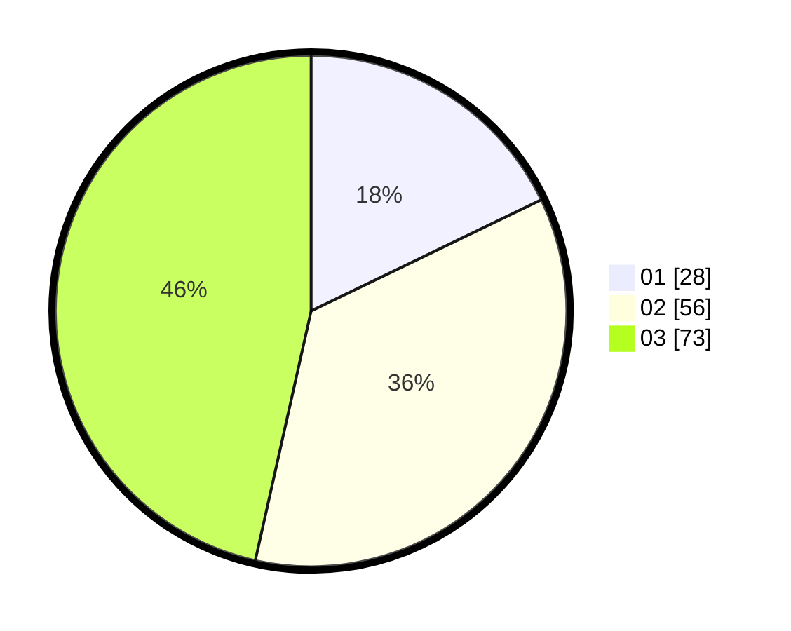

# Hasil

Hasil perolehan suara paslon dapat dilihat pada file paslon-01.txt, paslon-02.txt, dan paslon-03.txt.

Jika tidak ada, artinya data tersebut belum ada pada SIREKAP.

## Perolehan Suara

 * Paslon 01: **28**.
 * Paslon 02: **56**.
 * Paslon 03: **73**.

## Foto C Plano

https://sirekap-obj-formc.kpu.go.id/d771/pemilu/ppwp/31/71/02/10/01/3171021001016-20240216-211221--8c6ded0f-f668-405d-ad1a-380e5f4fb75d.jpg

https://sirekap-obj-formc.kpu.go.id/d771/pemilu/ppwp/31/71/02/10/01/3171021001016-20240216-211222--6a879b60-0e7e-453d-be6f-1e7dac02ebcf.jpg

https://sirekap-obj-formc.kpu.go.id/d771/pemilu/ppwp/31/71/02/10/01/3171021001016-20240216-211221--5ea08b41-da43-46ce-93ff-bcff70e36822.jpg

## DATA PEMILIH TETAP

Jumlah pemilih dalam DPT: **221**.
 * L: **94**.
 * P: **127**.

## DATA PENGGUNA HAK PILIH

Jumlah pengguna hak pilih dalam DPT: **141**.
 * L: **62**.
 * P: **79**.

Jumlah pengguna hak pilih dalam DPTb: **15**.
 * L: **3**.
 * P: **12**.

Jumlah pengguna hak pilih dalam DPK: **3**.
 * L: **1**.
 * P: **2**.

Jumlah pengguna hak pilih: **159**.
 * L: **66**.
 * P: **93**.

## JUMLAH SUARA SAH DAN TIDAK SAH

JUMLAH SELURUH SUARA SAH: **157**.

JUMLAH SUARA TIDAK SAH: **2**.

JUMLAH SELURUH SUARA SAH DAN SUARA TIDAK SAH: **159**.
