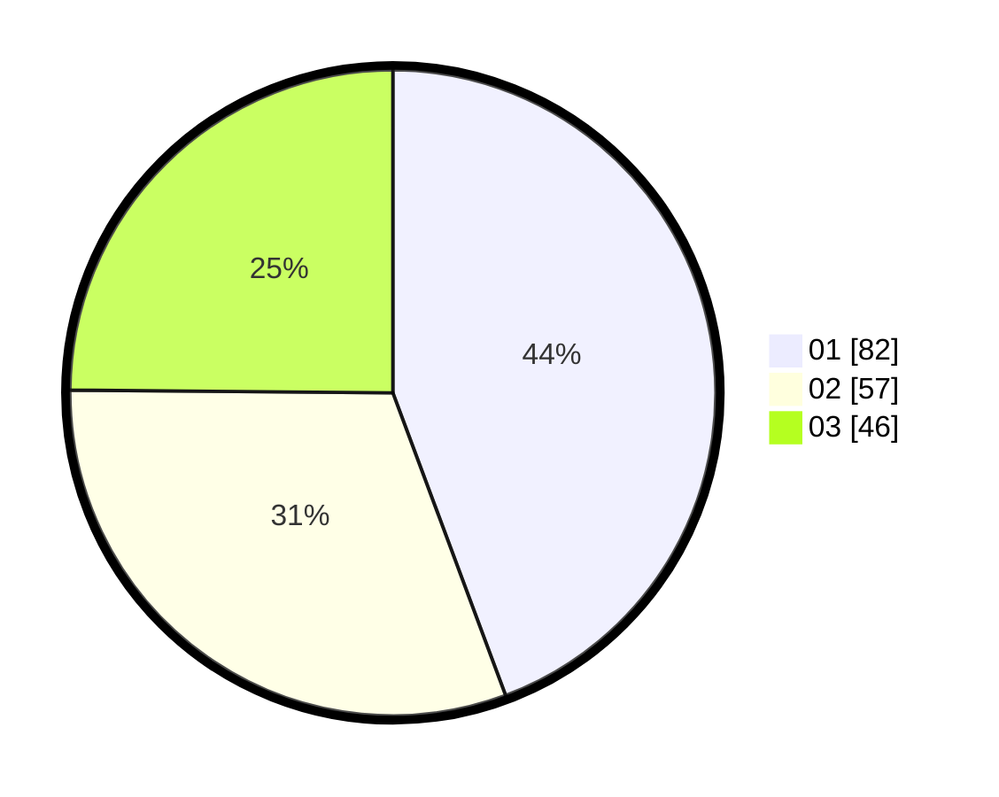

# Hasil

Hasil perolehan suara paslon dapat dilihat pada file paslon-01.txt, paslon-02.txt, dan paslon-03.txt.

Jika tidak ada, artinya data tersebut belum ada pada SIREKAP.

## Perolehan Suara

 * Paslon 01: **82**.
 * Paslon 02: **57**.
 * Paslon 03: **46**.

## Foto C Plano

https://sirekap-obj-formc.kpu.go.id/9bad/pemilu/ppwp/31/71/02/10/01/3171021001017-20240215-184632--a54dc6ff-7179-4881-a788-525d82a08ca6.jpg

https://sirekap-obj-formc.kpu.go.id/9bad/pemilu/ppwp/31/71/02/10/01/3171021001017-20240215-184653--d1cb5e02-0ad8-4eda-970b-25683678bff9.jpg

https://sirekap-obj-formc.kpu.go.id/9bad/pemilu/ppwp/31/71/02/10/01/3171021001017-20240215-184643--0926e600-d491-4854-bce4-f55db2bb2d8d.jpg

## DATA PEMILIH TETAP

Jumlah pemilih dalam DPT: **212**.
 * L: **95**.
 * P: **117**.

## DATA PENGGUNA HAK PILIH

Jumlah pengguna hak pilih dalam DPT: **178**.
 * L: **80**.
 * P: **98**.

Jumlah pengguna hak pilih dalam DPTb: **13**.
 * L: **6**.
 * P: **7**.

Jumlah pengguna hak pilih dalam DPK: **0**.
 * L: **0**.
 * P: **0**.

Jumlah pengguna hak pilih: **191**.
 * L: **86**.
 * P: **105**.

## JUMLAH SUARA SAH DAN TIDAK SAH

JUMLAH SELURUH SUARA SAH: **185**.

JUMLAH SUARA TIDAK SAH: **6**.

JUMLAH SELURUH SUARA SAH DAN SUARA TIDAK SAH: **191**.
