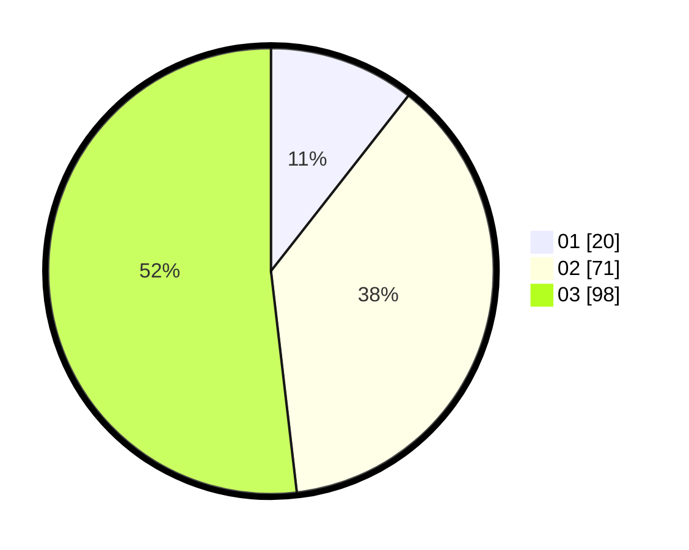

# Hasil

Hasil perolehan suara paslon dapat dilihat pada file paslon-01.txt, paslon-02.txt, dan paslon-03.txt.

Jika tidak ada, artinya data tersebut belum ada pada SIREKAP.

## Perolehan Suara

 * Paslon 01: **20**.
 * Paslon 02: **71**.
 * Paslon 03: **98**.

## Foto C Plano

https://sirekap-obj-formc.kpu.go.id/0641/pemilu/ppwp/31/71/02/10/01/3171021001018-20240216-091000--df1e7dd3-7242-4fce-b0ac-a99b2b2d2377.jpg

https://sirekap-obj-formc.kpu.go.id/0641/pemilu/ppwp/31/71/02/10/01/3171021001018-20240216-091007--f437c79c-e92e-446b-8b7a-06c8b8cad799.jpg

https://sirekap-obj-formc.kpu.go.id/0641/pemilu/ppwp/31/71/02/10/01/3171021001018-20240216-091005--c450c427-ca5b-4998-8c5c-9d69cb11688c.jpg

## DATA PEMILIH TETAP

Jumlah pemilih dalam DPT: **0**.
 * L: **0**.
 * P: **0**.

## DATA PENGGUNA HAK PILIH

Jumlah pengguna hak pilih dalam DPT: **0**.
 * L: **0**.
 * P: **0**.

Jumlah pengguna hak pilih dalam DPTb: **0**.
 * L: **0**.
 * P: **0**.

Jumlah pengguna hak pilih dalam DPK: **0**.
 * L: **0**.
 * P: **0**.

Jumlah pengguna hak pilih: **0**.
 * L: **0**.
 * P: **0**.

## JUMLAH SUARA SAH DAN TIDAK SAH

JUMLAH SELURUH SUARA SAH: **189**.

JUMLAH SUARA TIDAK SAH: **1**.

JUMLAH SELURUH SUARA SAH DAN SUARA TIDAK SAH: **190**.
