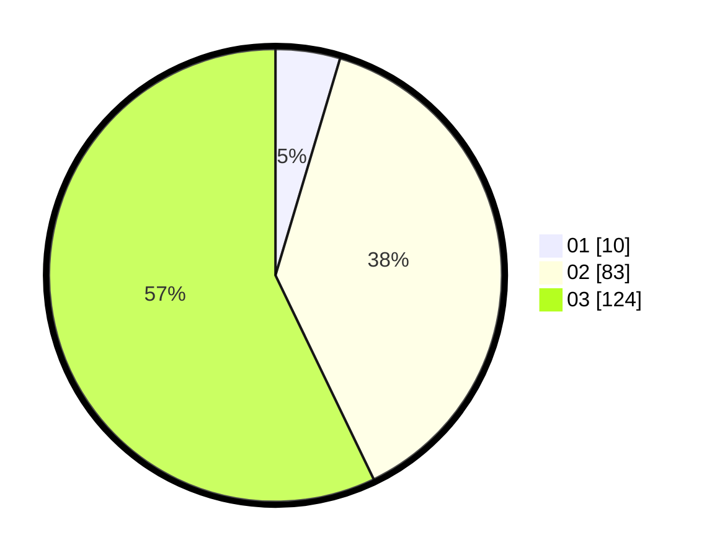

# Hasil

Hasil perolehan suara paslon dapat dilihat pada file paslon-01.txt, paslon-02.txt, dan paslon-03.txt.

Jika tidak ada, artinya data tersebut belum ada pada SIREKAP.

## Perolehan Suara

 * Paslon 01: **10**.
 * Paslon 02: **83**.
 * Paslon 03: **124**.

## Foto C Plano

https://sirekap-obj-formc.kpu.go.id/41c6/pemilu/ppwp/31/71/02/10/01/3171021001023-20240216-155855--5b68af6e-63e6-4e59-bd84-fbf183692605.jpg

https://sirekap-obj-formc.kpu.go.id/41c6/pemilu/ppwp/31/71/02/10/01/3171021001023-20240216-155856--49f88215-eb59-4002-997f-3877da2b1017.jpg

https://sirekap-obj-formc.kpu.go.id/41c6/pemilu/ppwp/31/71/02/10/01/3171021001023-20240216-155855--a861b682-beb3-4fad-9da6-98f262256b42.jpg

## DATA PEMILIH TETAP

Jumlah pemilih dalam DPT: **279**.
 * L: **141**.
 * P: **138**.

## DATA PENGGUNA HAK PILIH

Jumlah pengguna hak pilih dalam DPT: **206**.
 * L: **108**.
 * P: **98**.

Jumlah pengguna hak pilih dalam DPTb: **11**.
 * L: **4**.
 * P: **7**.

Jumlah pengguna hak pilih dalam DPK: **1**.
 * L: **1**.
 * P: **0**.

Jumlah pengguna hak pilih: **218**.
 * L: **113**.
 * P: **105**.

## JUMLAH SUARA SAH DAN TIDAK SAH

JUMLAH SELURUH SUARA SAH: **217**.

JUMLAH SUARA TIDAK SAH: **1**.

JUMLAH SELURUH SUARA SAH DAN SUARA TIDAK SAH: **218**.
