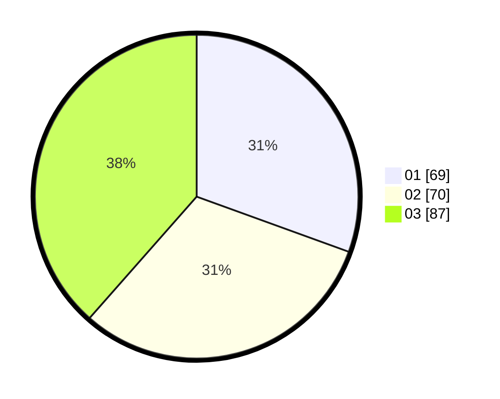

# Hasil

Hasil perolehan suara paslon dapat dilihat pada file paslon-01.txt, paslon-02.txt, dan paslon-03.txt.

Jika tidak ada, artinya data tersebut belum ada pada SIREKAP.

## Perolehan Suara

 * Paslon 01: **69**.
 * Paslon 02: **70**.
 * Paslon 03: **87**.

## Foto C Plano

https://sirekap-obj-formc.kpu.go.id/43b7/pemilu/ppwp/31/71/02/10/01/3171021001028-20240214-234413--347369b5-5a62-4073-9cc3-79ffa1ea3114.jpg

https://sirekap-obj-formc.kpu.go.id/43b7/pemilu/ppwp/31/71/02/10/01/3171021001028-20240215-001916--000d5082-5c3b-4f76-8e0d-42e58342a1d8.jpg

https://sirekap-obj-formc.kpu.go.id/43b7/pemilu/ppwp/31/71/02/10/01/3171021001028-20240214-235113--602ccfbc-3e0d-4e33-a0f1-dc0d6af03271.jpg
