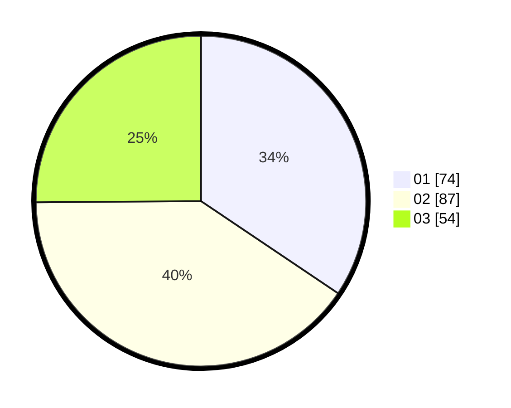

# Hasil

Hasil perolehan suara paslon dapat dilihat pada file paslon-01.txt, paslon-02.txt, dan paslon-03.txt.

Jika tidak ada, artinya data tersebut belum ada pada SIREKAP.

## Perolehan Suara

 * Paslon 01: **74**.
 * Paslon 02: **87**.
 * Paslon 03: **54**.

## Foto C Plano

https://sirekap-obj-formc.kpu.go.id/3904/pemilu/ppwp/31/71/02/10/01/3171021001029-20240214-155311--edc299bf-c71e-4244-8c7e-7ca5e33a9dc1.jpg

https://sirekap-obj-formc.kpu.go.id/3904/pemilu/ppwp/31/71/02/10/01/3171021001029-20240214-230002--3a8d895f-f2d1-4df9-96b0-4165334dc707.jpg

https://sirekap-obj-formc.kpu.go.id/3904/pemilu/ppwp/31/71/02/10/01/3171021001029-20240214-230035--526e4fc1-1db3-4e22-8f81-99375610bf9b.jpg
