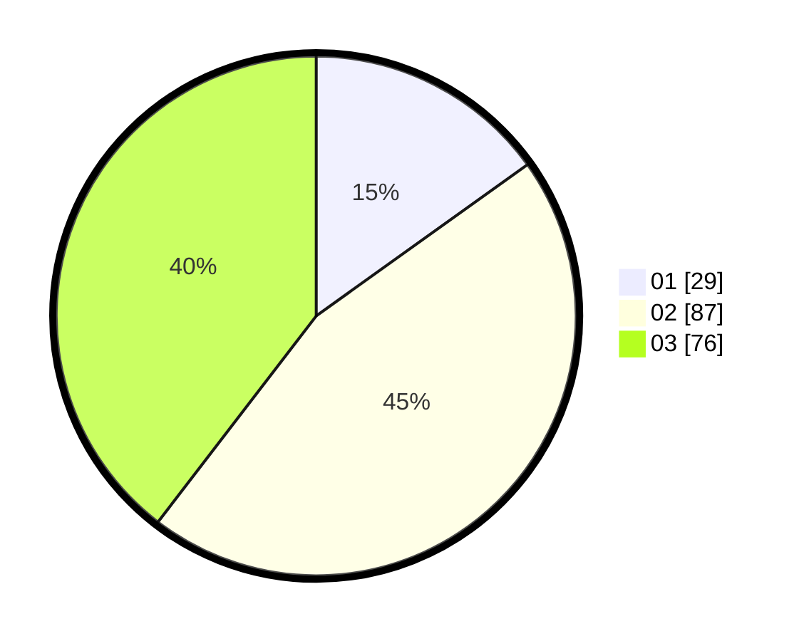

# Hasil

Hasil perolehan suara paslon dapat dilihat pada file paslon-01.txt, paslon-02.txt, dan paslon-03.txt.

Jika tidak ada, artinya data tersebut belum ada pada SIREKAP.

## Perolehan Suara

 * Paslon 01: **29**.
 * Paslon 02: **87**.
 * Paslon 03: **76**.

## Foto C Plano

https://sirekap-obj-formc.kpu.go.id/7f1a/pemilu/ppwp/31/71/02/10/01/3171021001031-20240216-142538--6f2f93c2-403a-4ced-b840-d540d5150344.jpg

https://sirekap-obj-formc.kpu.go.id/7f1a/pemilu/ppwp/31/71/02/10/01/3171021001031-20240216-142539--0424aa0e-fbc9-4dc7-bede-d601546f896d.jpg

https://sirekap-obj-formc.kpu.go.id/7f1a/pemilu/ppwp/31/71/02/10/01/3171021001031-20240216-142538--312e165f-f129-47e5-a9b2-7362c0157fb3.jpg

## DATA PEMILIH TETAP

Jumlah pemilih dalam DPT: **266**.
 * L: **119**.
 * P: **147**.

## DATA PENGGUNA HAK PILIH

Jumlah pengguna hak pilih dalam DPT: **191**.
 * L: **85**.
 * P: **106**.

Jumlah pengguna hak pilih dalam DPTb: **2**.
 * L: **1**.
 * P: **1**.

Jumlah pengguna hak pilih dalam DPK: **3**.
 * L: **1**.
 * P: **2**.

Jumlah pengguna hak pilih: **196**.
 * L: **87**.
 * P: **109**.

## JUMLAH SUARA SAH DAN TIDAK SAH

JUMLAH SELURUH SUARA SAH: **192**.

JUMLAH SUARA TIDAK SAH: **4**.

JUMLAH SELURUH SUARA SAH DAN SUARA TIDAK SAH: **196**.
