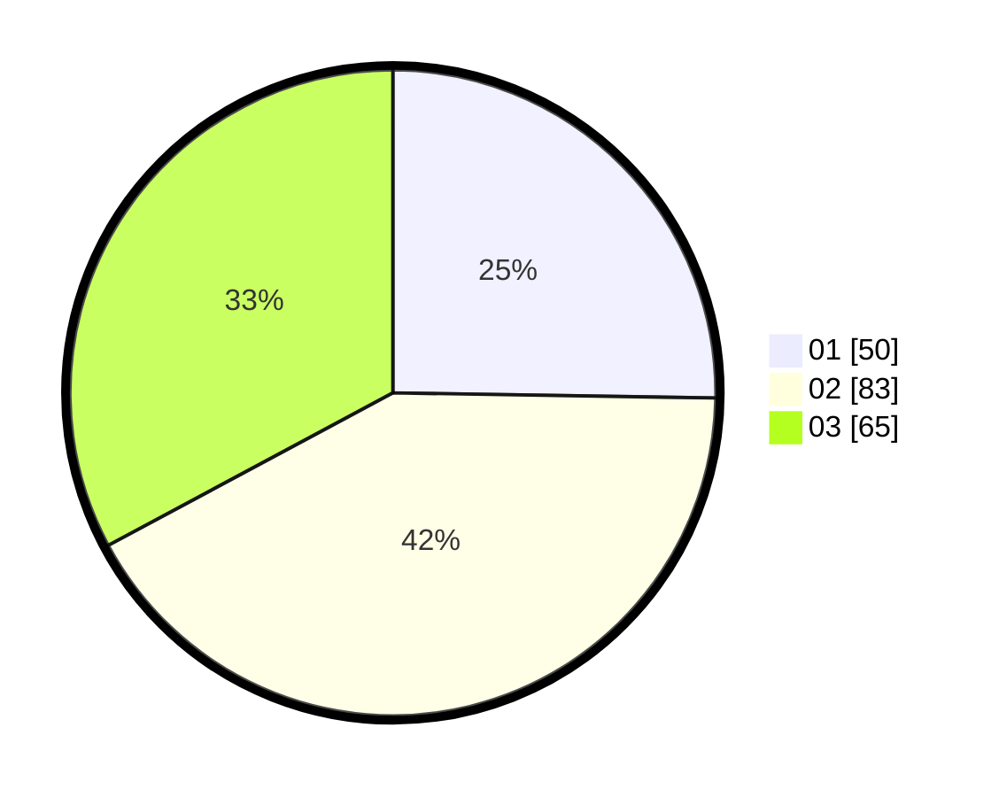

# Hasil

Hasil perolehan suara paslon dapat dilihat pada file paslon-01.txt, paslon-02.txt, dan paslon-03.txt.

Jika tidak ada, artinya data tersebut belum ada pada SIREKAP.

## Perolehan Suara

 * Paslon 01: **50**.
 * Paslon 02: **83**.
 * Paslon 03: **65**.

## Foto C Plano

https://sirekap-obj-formc.kpu.go.id/6aa6/pemilu/ppwp/31/71/02/10/01/3171021001032-20240214-205805--2e432dda-55fd-440f-a42c-488129f72117.jpg

https://sirekap-obj-formc.kpu.go.id/6aa6/pemilu/ppwp/31/71/02/10/01/3171021001032-20240214-205941--2863b795-f744-445f-ae3a-e58db8cc0f34.jpg

https://sirekap-obj-formc.kpu.go.id/6aa6/pemilu/ppwp/31/71/02/10/01/3171021001032-20240214-210130--6d900952-e344-4c17-91c7-d52b12ba5848.jpg

## DATA PEMILIH TETAP

Jumlah pemilih dalam DPT: **282**.
 * L: **130**.
 * P: **152**.

## DATA PENGGUNA HAK PILIH

Jumlah pengguna hak pilih dalam DPT: **183**.
 * L: **85**.
 * P: **98**.

Jumlah pengguna hak pilih dalam DPTb: **13**.
 * L: **4**.
 * P: **9**.

Jumlah pengguna hak pilih dalam DPK: **6**.
 * L: **2**.
 * P: **4**.

Jumlah pengguna hak pilih: **296**.
 * L: **134**.
 * P: **163**.

## JUMLAH SUARA SAH DAN TIDAK SAH

JUMLAH SELURUH SUARA SAH: **198**.

JUMLAH SUARA TIDAK SAH: **5**.

JUMLAH SELURUH SUARA SAH DAN SUARA TIDAK SAH: **203**.
