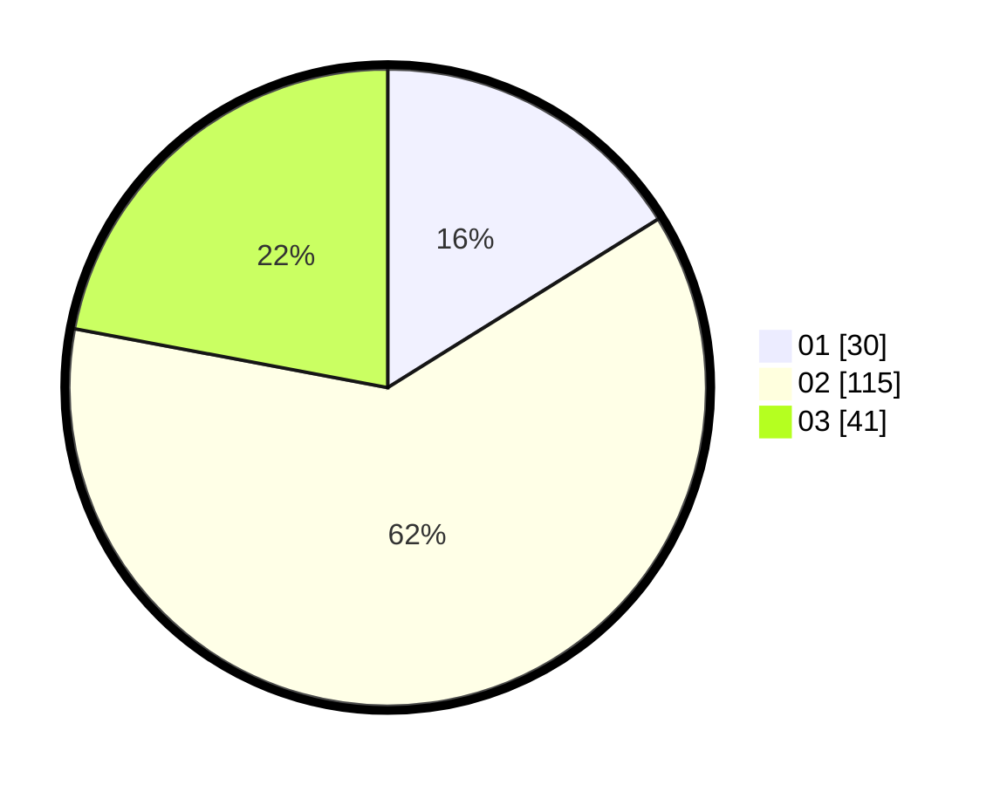

# Hasil

Hasil perolehan suara paslon dapat dilihat pada file paslon-01.txt, paslon-02.txt, dan paslon-03.txt.

Jika tidak ada, artinya data tersebut belum ada pada SIREKAP.

## Perolehan Suara

 * Paslon 01: **30**.
 * Paslon 02: **115**.
 * Paslon 03: **41**.

## Foto C Plano

https://sirekap-obj-formc.kpu.go.id/68a7/pemilu/ppwp/31/71/02/10/01/3171021001033-20240216-155827--f969eeef-75a5-4053-8478-2f86abef92d1.jpg

https://sirekap-obj-formc.kpu.go.id/68a7/pemilu/ppwp/31/71/02/10/01/3171021001033-20240216-155829--152a640b-794d-411d-a705-c6fd4579b94d.jpg

https://sirekap-obj-formc.kpu.go.id/68a7/pemilu/ppwp/31/71/02/10/01/3171021001033-20240216-155828--b4d9dd11-67b3-431d-af1d-6646874fd835.jpg

## DATA PEMILIH TETAP

Jumlah pemilih dalam DPT: **279**.
 * L: **145**.
 * P: **134**.

## DATA PENGGUNA HAK PILIH

Jumlah pengguna hak pilih dalam DPT: **183**.
 * L: **92**.
 * P: **91**.

Jumlah pengguna hak pilih dalam DPTb: **5**.
 * L: **5**.
 * P: **0**.

Jumlah pengguna hak pilih dalam DPK: **4**.
 * L: **1**.
 * P: **3**.

Jumlah pengguna hak pilih: **192**.
 * L: **98**.
 * P: **94**.

## JUMLAH SUARA SAH DAN TIDAK SAH

JUMLAH SELURUH SUARA SAH: **186**.

JUMLAH SUARA TIDAK SAH: **6**.

JUMLAH SELURUH SUARA SAH DAN SUARA TIDAK SAH: **192**.
