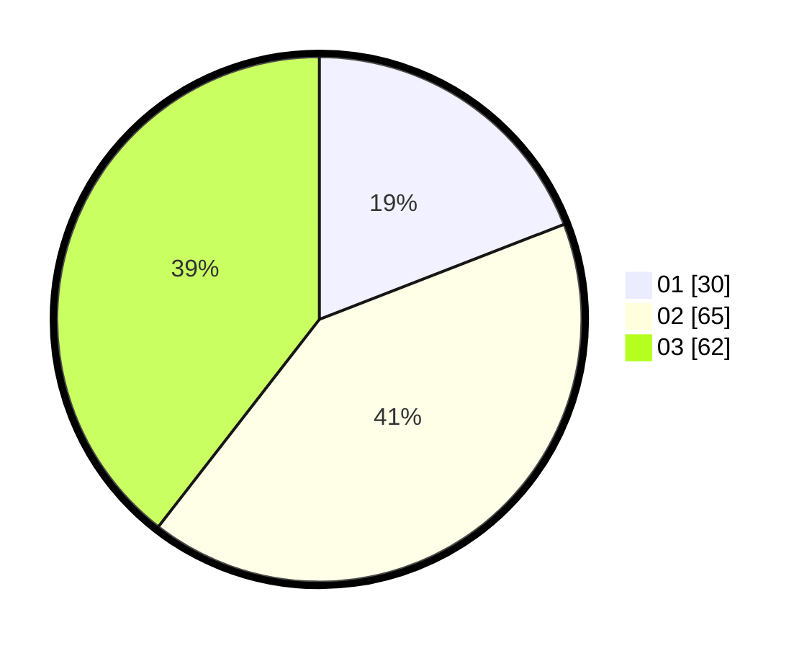

# Hasil

Hasil perolehan suara paslon dapat dilihat pada file paslon-01.txt, paslon-02.txt, dan paslon-03.txt.

Jika tidak ada, artinya data tersebut belum ada pada SIREKAP.

## Perolehan Suara

 * Paslon 01: **30**.
 * Paslon 02: **65**.
 * Paslon 03: **62**.

## Foto C Plano

https://sirekap-obj-formc.kpu.go.id/05d1/pemilu/ppwp/31/71/02/10/01/3171021001034-20240214-202030--c17f6487-4ebb-49c0-8528-fb564a0557ad.jpg

https://sirekap-obj-formc.kpu.go.id/05d1/pemilu/ppwp/31/71/02/10/01/3171021001034-20240214-202149--037184c2-70cc-4b9c-8f42-66e0ce2642b9.jpg

https://sirekap-obj-formc.kpu.go.id/05d1/pemilu/ppwp/31/71/02/10/01/3171021001034-20240214-202245--189feb31-48f9-4c80-afbe-187c6c858d58.jpg

## DATA PEMILIH TETAP

Jumlah pemilih dalam DPT: **234**.
 * L: **118**.
 * P: **116**.

## DATA PENGGUNA HAK PILIH

Jumlah pengguna hak pilih dalam DPT: **156**.
 * L: **75**.
 * P: **81**.

Jumlah pengguna hak pilih dalam DPTb: **1**.
 * L: **0**.
 * P: **1**.

Jumlah pengguna hak pilih dalam DPK: **2**.
 * L: **0**.
 * P: **2**.

Jumlah pengguna hak pilih: **159**.
 * L: **75**.
 * P: **84**.

## JUMLAH SUARA SAH DAN TIDAK SAH

JUMLAH SELURUH SUARA SAH: **157**.

JUMLAH SUARA TIDAK SAH: **2**.

JUMLAH SELURUH SUARA SAH DAN SUARA TIDAK SAH: **159**.
