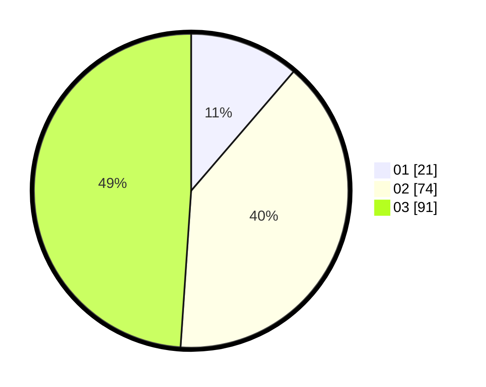

# Hasil

Hasil perolehan suara paslon dapat dilihat pada file paslon-01.txt, paslon-02.txt, dan paslon-03.txt.

Jika tidak ada, artinya data tersebut belum ada pada SIREKAP.

## Perolehan Suara

 * Paslon 01: **21**.
 * Paslon 02: **74**.
 * Paslon 03: **91**.

## Foto C Plano

https://sirekap-obj-formc.kpu.go.id/9423/pemilu/ppwp/31/71/02/10/01/3171021001036-20240214-184746--bf14ce7c-74af-4d10-90d3-fdb5a4830225.jpg

https://sirekap-obj-formc.kpu.go.id/9423/pemilu/ppwp/31/71/02/10/01/3171021001036-20240215-204706--94d704e5-60a3-49d3-ae09-386c6668423b.jpg

https://sirekap-obj-formc.kpu.go.id/9423/pemilu/ppwp/31/71/02/10/01/3171021001036-20240214-155846--d3d3a0c4-c34c-4353-b948-82ad76336547.jpg

## DATA PEMILIH TETAP

Jumlah pemilih dalam DPT: **252**.
 * L: **122**.
 * P: **130**.

## DATA PENGGUNA HAK PILIH

Jumlah pengguna hak pilih dalam DPT: **163**.
 * L: **74**.
 * P: **89**.

Jumlah pengguna hak pilih dalam DPTb: **9**.
 * L: **5**.
 * P: **4**.

Jumlah pengguna hak pilih dalam DPK: **6**.
 * L: **4**.
 * P: **2**.

Jumlah pengguna hak pilih: **178**.
 * L: **83**.
 * P: **95**.

## JUMLAH SUARA SAH DAN TIDAK SAH

JUMLAH SELURUH SUARA SAH: **176**.

JUMLAH SUARA TIDAK SAH: **2**.

JUMLAH SELURUH SUARA SAH DAN SUARA TIDAK SAH: **178**.
