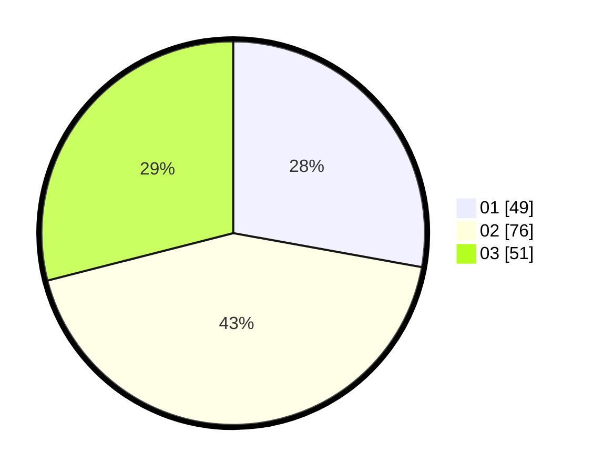

# Hasil

Hasil perolehan suara paslon dapat dilihat pada file paslon-01.txt, paslon-02.txt, dan paslon-03.txt.

Jika tidak ada, artinya data tersebut belum ada pada SIREKAP.

## Perolehan Suara

 * Paslon 01: **49**.
 * Paslon 02: **76**.
 * Paslon 03: **51**.

## Foto C Plano

https://sirekap-obj-formc.kpu.go.id/201e/pemilu/ppwp/31/71/02/10/01/3171021001042-20240214-184646--cdc058c0-b6b7-4180-9360-3bdf0fb78e03.jpg

https://sirekap-obj-formc.kpu.go.id/201e/pemilu/ppwp/31/71/02/10/01/3171021001042-20240214-191555--3f18cf92-fe06-4ff3-9d92-40005f182356.jpg

https://sirekap-obj-formc.kpu.go.id/201e/pemilu/ppwp/31/71/02/10/01/3171021001042-20240214-185320--998dd493-c0dd-4609-b35d-d64f9f0bdf9b.jpg

## DATA PEMILIH TETAP

Jumlah pemilih dalam DPT: **232**.
 * L: **95**.
 * P: **137**.

## DATA PENGGUNA HAK PILIH

Jumlah pengguna hak pilih dalam DPT: **151**.
 * L: **66**.
 * P: **85**.

Jumlah pengguna hak pilih dalam DPTb: **25**.
 * L: **6**.
 * P: **19**.

Jumlah pengguna hak pilih dalam DPK: **1**.
 * L: **0**.
 * P: **1**.

Jumlah pengguna hak pilih: **177**.
 * L: **72**.
 * P: **105**.

## JUMLAH SUARA SAH DAN TIDAK SAH

JUMLAH SELURUH SUARA SAH: **176**.

JUMLAH SUARA TIDAK SAH: **1**.

JUMLAH SELURUH SUARA SAH DAN SUARA TIDAK SAH: **177**.
