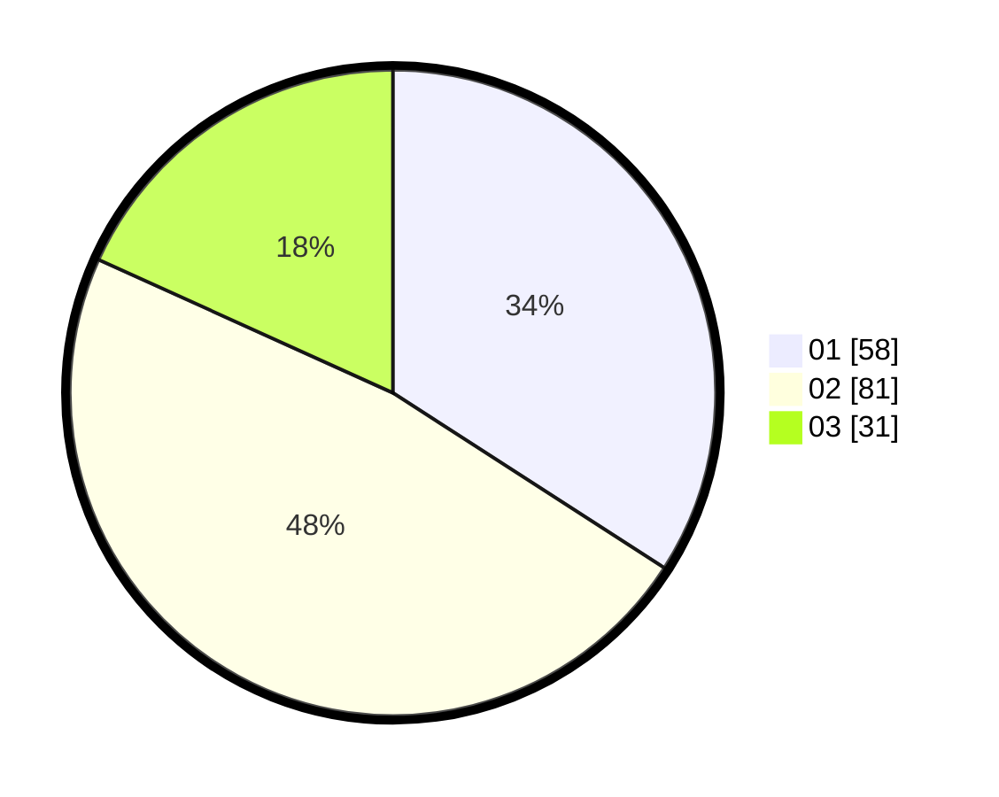

# Hasil

Hasil perolehan suara paslon dapat dilihat pada file paslon-01.txt, paslon-02.txt, dan paslon-03.txt.

Jika tidak ada, artinya data tersebut belum ada pada SIREKAP.

## Perolehan Suara

 * Paslon 01: **58**.
 * Paslon 02: **81**.
 * Paslon 03: **31**.

## Foto C Plano

https://sirekap-obj-formc.kpu.go.id/6bbd/pemilu/ppwp/31/71/02/10/01/3171021001044-20240215-035438--d84a371b-3d74-42ec-9018-9287a7cfd0cb.jpg

https://sirekap-obj-formc.kpu.go.id/6bbd/pemilu/ppwp/31/71/02/10/01/3171021001044-20240215-035459--9bbcdc43-5093-4163-9d22-b7c592c3f594.jpg

https://sirekap-obj-formc.kpu.go.id/6bbd/pemilu/ppwp/31/71/02/10/01/3171021001044-20240215-035448--3e2d97c0-36d5-4b98-8e21-667f48534f24.jpg

## DATA PEMILIH TETAP

Jumlah pemilih dalam DPT: **216**.
 * L: **111**.
 * P: **105**.

## DATA PENGGUNA HAK PILIH

Jumlah pengguna hak pilih dalam DPT: **156**.
 * L: **78**.
 * P: **78**.

Jumlah pengguna hak pilih dalam DPTb: **17**.
 * L: **11**.
 * P: **6**.

Jumlah pengguna hak pilih dalam DPK: **1**.
 * L: **0**.
 * P: **1**.

Jumlah pengguna hak pilih: **174**.
 * L: **89**.
 * P: **85**.

## JUMLAH SUARA SAH DAN TIDAK SAH

JUMLAH SELURUH SUARA SAH: **170**.

JUMLAH SUARA TIDAK SAH: **4**.

JUMLAH SELURUH SUARA SAH DAN SUARA TIDAK SAH: **174**.
