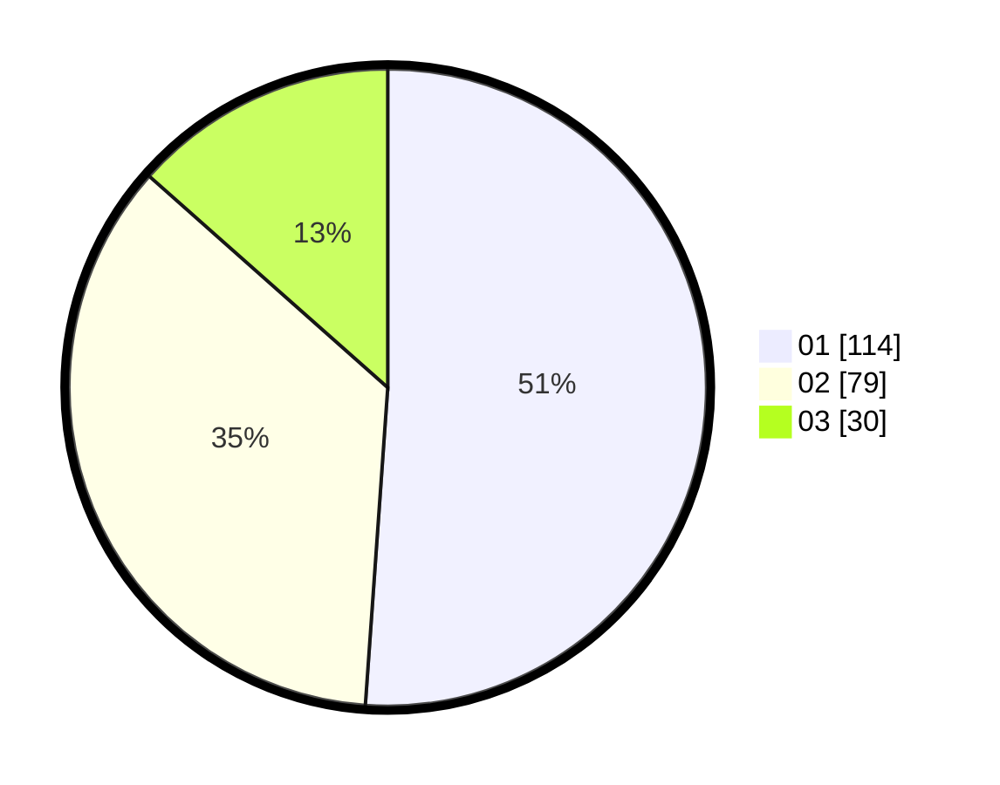

# Hasil

Hasil perolehan suara paslon dapat dilihat pada file paslon-01.txt, paslon-02.txt, dan paslon-03.txt.

Jika tidak ada, artinya data tersebut belum ada pada SIREKAP.

## Perolehan Suara

 * Paslon 01: **114**.
 * Paslon 02: **79**.
 * Paslon 03: **30**.

## Foto C Plano

https://sirekap-obj-formc.kpu.go.id/9934/pemilu/ppwp/31/71/02/10/02/3171021002001-20240216-190437--e42c0e32-82e8-4c23-bd4a-f9a9de44609f.jpg

https://sirekap-obj-formc.kpu.go.id/9934/pemilu/ppwp/31/71/02/10/02/3171021002001-20240216-190439--7f4c914f-72d6-4053-9c7f-720c781bf4b7.jpg

https://sirekap-obj-formc.kpu.go.id/9934/pemilu/ppwp/31/71/02/10/02/3171021002001-20240216-190438--cb42c7e0-0b46-4019-a143-0fe1988d184b.jpg

## DATA PEMILIH TETAP

Jumlah pemilih dalam DPT: **268**.
 * L: **144**.
 * P: **124**.

## DATA PENGGUNA HAK PILIH

Jumlah pengguna hak pilih dalam DPT: **217**.
 * L: **116**.
 * P: **101**.

Jumlah pengguna hak pilih dalam DPTb: **6**.
 * L: **4**.
 * P: **2**.

Jumlah pengguna hak pilih dalam DPK: **4**.
 * L: **1**.
 * P: **3**.

Jumlah pengguna hak pilih: **227**.
 * L: **121**.
 * P: **106**.

## JUMLAH SUARA SAH DAN TIDAK SAH

JUMLAH SELURUH SUARA SAH: **223**.

JUMLAH SUARA TIDAK SAH: **4**.

JUMLAH SELURUH SUARA SAH DAN SUARA TIDAK SAH: **227**.
