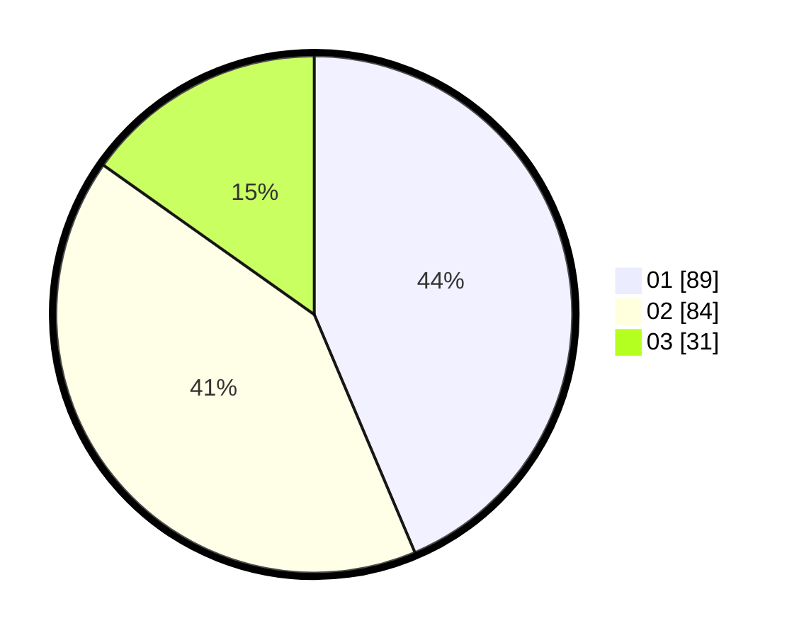

# Hasil

Hasil perolehan suara paslon dapat dilihat pada file paslon-01.txt, paslon-02.txt, dan paslon-03.txt.

Jika tidak ada, artinya data tersebut belum ada pada SIREKAP.

## Perolehan Suara

 * Paslon 01: **89**.
 * Paslon 02: **84**.
 * Paslon 03: **31**.

## Foto C Plano

https://sirekap-obj-formc.kpu.go.id/196c/pemilu/ppwp/31/71/02/10/02/3171021002002-20240215-231711--f3482b59-d532-4fa1-99a0-7fb7955d8595.jpg

https://sirekap-obj-formc.kpu.go.id/196c/pemilu/ppwp/31/71/02/10/02/3171021002002-20240216-165516--420b044e-ffc5-4df2-9522-0613d29ca36a.jpg

https://sirekap-obj-formc.kpu.go.id/196c/pemilu/ppwp/31/71/02/10/02/3171021002002-20240216-165516--e7a436e1-53c4-4aa3-a70a-4d1bba891d95.jpg

## DATA PEMILIH TETAP

Jumlah pemilih dalam DPT: **278**.
 * L: **144**.
 * P: **134**.

## DATA PENGGUNA HAK PILIH

Jumlah pengguna hak pilih dalam DPT: **200**.
 * L: **105**.
 * P: **95**.

Jumlah pengguna hak pilih dalam DPTb: **5**.
 * L: **1**.
 * P: **4**.

Jumlah pengguna hak pilih dalam DPK: **1**.
 * L: **1**.
 * P: **0**.

Jumlah pengguna hak pilih: **206**.
 * L: **107**.
 * P: **99**.

## JUMLAH SUARA SAH DAN TIDAK SAH

JUMLAH SELURUH SUARA SAH: **204**.

JUMLAH SUARA TIDAK SAH: **2**.

JUMLAH SELURUH SUARA SAH DAN SUARA TIDAK SAH: **206**.
