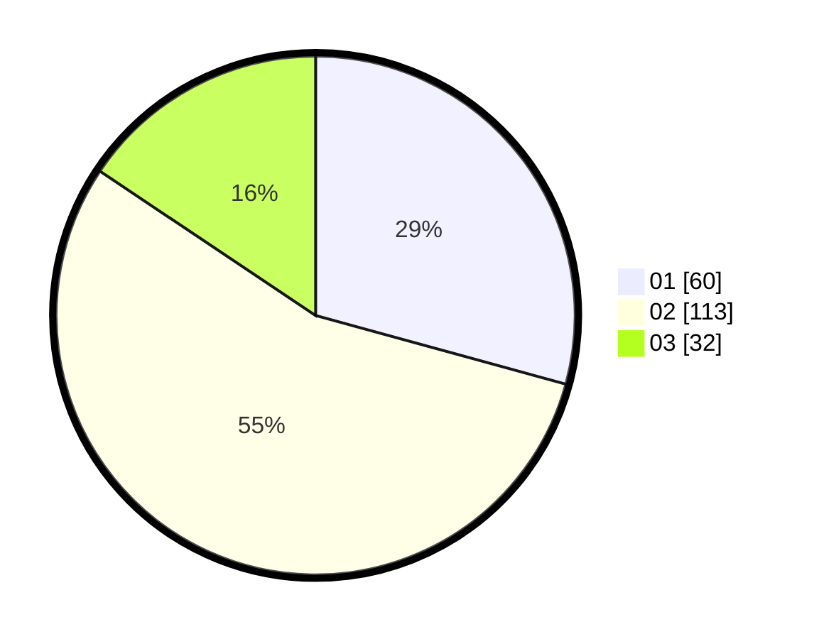

# Hasil

Hasil perolehan suara paslon dapat dilihat pada file paslon-01.txt, paslon-02.txt, dan paslon-03.txt.

Jika tidak ada, artinya data tersebut belum ada pada SIREKAP.

## Perolehan Suara

 * Paslon 01: **60**.
 * Paslon 02: **113**.
 * Paslon 03: **32**.

## Foto C Plano

https://sirekap-obj-formc.kpu.go.id/cb3f/pemilu/ppwp/31/71/02/10/02/3171021002006-20240216-160433--bd436635-b4c8-4c19-8324-eb2b3b4b01c4.jpg

https://sirekap-obj-formc.kpu.go.id/cb3f/pemilu/ppwp/31/71/02/10/02/3171021002006-20240216-160435--8a911346-d09e-4e13-a9a0-96c2f77fec33.jpg

https://sirekap-obj-formc.kpu.go.id/cb3f/pemilu/ppwp/31/71/02/10/02/3171021002006-20240216-160434--8f710f45-f896-4353-a2cc-5cab0a2565a4.jpg

## DATA PEMILIH TETAP

Jumlah pemilih dalam DPT: **268**.
 * L: **124**.
 * P: **144**.

## DATA PENGGUNA HAK PILIH

Jumlah pengguna hak pilih dalam DPT: **199**.
 * L: **92**.
 * P: **107**.

Jumlah pengguna hak pilih dalam DPTb: **0**.
 * L: **0**.
 * P: **0**.

Jumlah pengguna hak pilih dalam DPK: **6**.
 * L: **3**.
 * P: **3**.

Jumlah pengguna hak pilih: **205**.
 * L: **95**.
 * P: **110**.

## JUMLAH SUARA SAH DAN TIDAK SAH

JUMLAH SELURUH SUARA SAH: **205**.

JUMLAH SUARA TIDAK SAH: **0**.

JUMLAH SELURUH SUARA SAH DAN SUARA TIDAK SAH: **205**.
