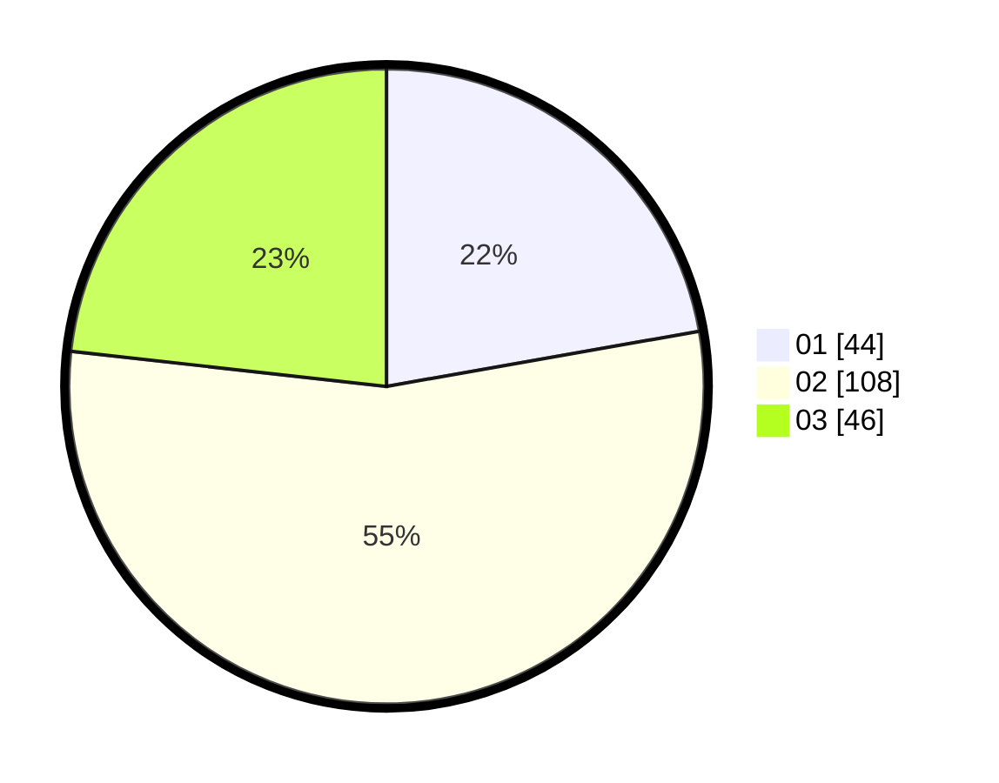

# Hasil

Hasil perolehan suara paslon dapat dilihat pada file paslon-01.txt, paslon-02.txt, dan paslon-03.txt.

Jika tidak ada, artinya data tersebut belum ada pada SIREKAP.

## Perolehan Suara

 * Paslon 01: **44**.
 * Paslon 02: **108**.
 * Paslon 03: **46**.

## Foto C Plano

https://sirekap-obj-formc.kpu.go.id/f92d/pemilu/ppwp/31/71/02/10/02/3171021002011-20240216-152025--35b0b7c9-ca1d-4b87-9554-f85f0b2fbc25.jpg

https://sirekap-obj-formc.kpu.go.id/f92d/pemilu/ppwp/31/71/02/10/02/3171021002011-20240216-152027--a10078a2-b8a8-42f3-b956-4c1221986553.jpg

https://sirekap-obj-formc.kpu.go.id/f92d/pemilu/ppwp/31/71/02/10/02/3171021002011-20240216-152026--147f3bfc-9149-445d-bd9a-b7f8d7660b1a.jpg

## DATA PEMILIH TETAP

Jumlah pemilih dalam DPT: **275**.
 * L: **139**.
 * P: **136**.

## DATA PENGGUNA HAK PILIH

Jumlah pengguna hak pilih dalam DPT: **199**.
 * L: **99**.
 * P: **100**.

Jumlah pengguna hak pilih dalam DPTb: **1**.
 * L: **1**.
 * P: **0**.

Jumlah pengguna hak pilih dalam DPK: **0**.
 * L: **0**.
 * P: **0**.

Jumlah pengguna hak pilih: **200**.
 * L: **100**.
 * P: **100**.

## JUMLAH SUARA SAH DAN TIDAK SAH

JUMLAH SELURUH SUARA SAH: **198**.

JUMLAH SUARA TIDAK SAH: **2**.

JUMLAH SELURUH SUARA SAH DAN SUARA TIDAK SAH: **200**.
