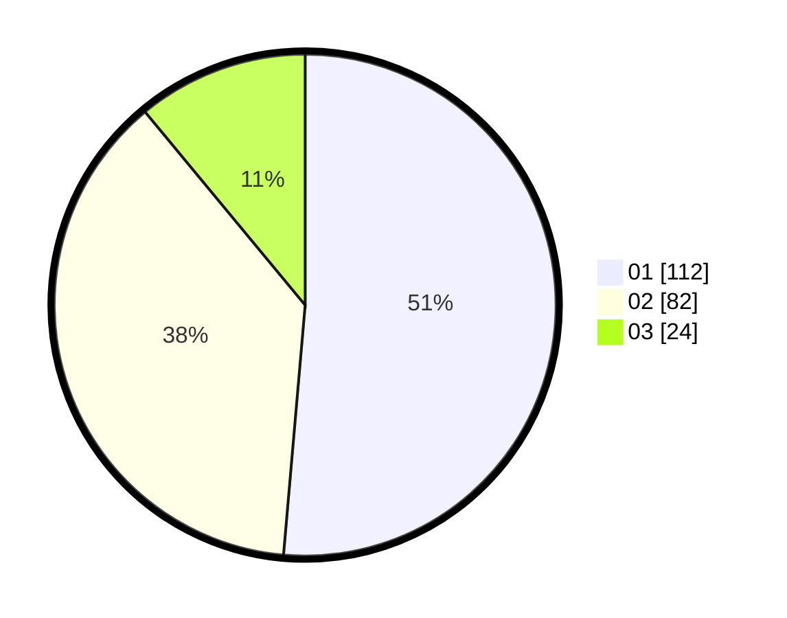

# Hasil

Hasil perolehan suara paslon dapat dilihat pada file paslon-01.txt, paslon-02.txt, dan paslon-03.txt.

Jika tidak ada, artinya data tersebut belum ada pada SIREKAP.

## Perolehan Suara

 * Paslon 01: **112**.
 * Paslon 02: **82**.
 * Paslon 03: **24**.

## Foto C Plano

https://sirekap-obj-formc.kpu.go.id/618a/pemilu/ppwp/31/71/02/10/02/3171021002016-20240217-010415--dc892d3a-fff8-4b1f-92d7-37b5302c1364.jpg

https://sirekap-obj-formc.kpu.go.id/618a/pemilu/ppwp/31/71/02/10/02/3171021002016-20240217-010416--16d2cccb-52c4-4eeb-b116-14b35b4cd948.jpg

https://sirekap-obj-formc.kpu.go.id/618a/pemilu/ppwp/31/71/02/10/02/3171021002016-20240216-074808--1b500c10-e031-4a95-97c0-d0bac25ad03d.jpg

## DATA PEMILIH TETAP

Jumlah pemilih dalam DPT: **281**.
 * L: **146**.
 * P: **135**.

## DATA PENGGUNA HAK PILIH

Jumlah pengguna hak pilih dalam DPT: **221**.
 * L: **109**.
 * P: **112**.

Jumlah pengguna hak pilih dalam DPTb: **0**.
 * L: **0**.
 * P: **0**.

Jumlah pengguna hak pilih dalam DPK: **0**.
 * L: **0**.
 * P: **0**.

Jumlah pengguna hak pilih: **221**.
 * L: **109**.
 * P: **112**.

## JUMLAH SUARA SAH DAN TIDAK SAH

JUMLAH SELURUH SUARA SAH: **218**.

JUMLAH SUARA TIDAK SAH: **3**.

JUMLAH SELURUH SUARA SAH DAN SUARA TIDAK SAH: **221**.
