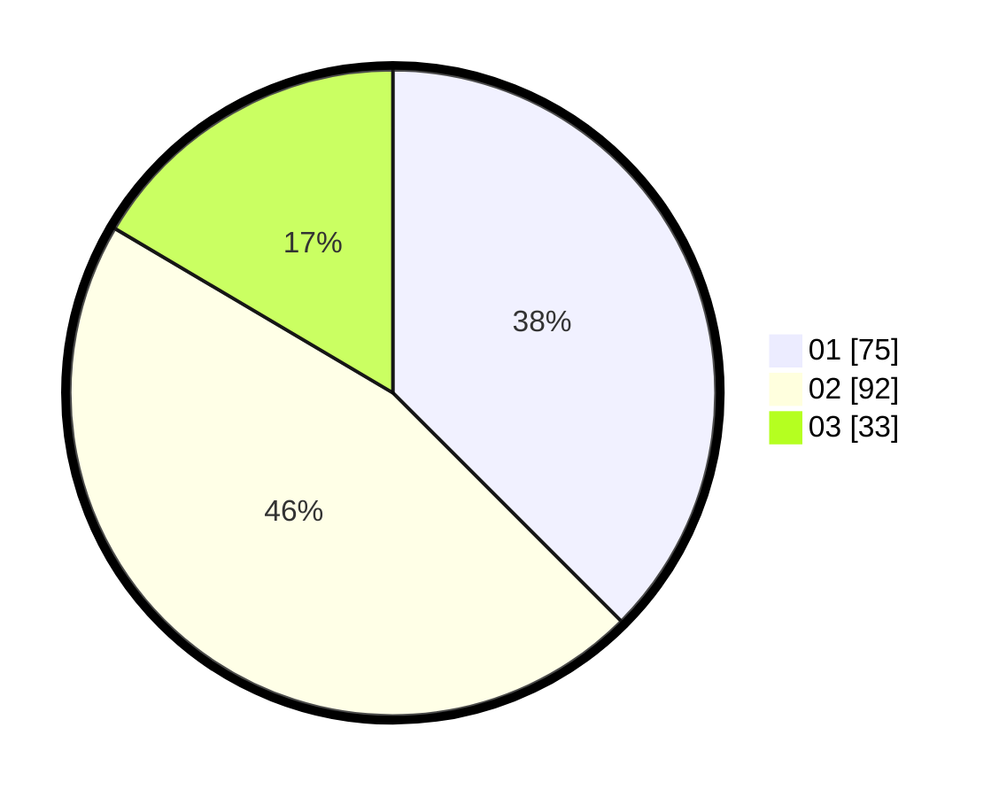

# Hasil

Hasil perolehan suara paslon dapat dilihat pada file paslon-01.txt, paslon-02.txt, dan paslon-03.txt.

Jika tidak ada, artinya data tersebut belum ada pada SIREKAP.

## Perolehan Suara

 * Paslon 01: **75**.
 * Paslon 02: **92**.
 * Paslon 03: **33**.

## Foto C Plano

https://sirekap-obj-formc.kpu.go.id/4482/pemilu/ppwp/31/71/02/10/02/3171021002017-20240214-233939--18342d1a-142e-4c1f-8050-f27ddb570d8e.jpg

https://sirekap-obj-formc.kpu.go.id/4482/pemilu/ppwp/31/71/02/10/02/3171021002017-20240214-234143--2db7d2d9-2c66-4a51-962e-bae7b8505ccb.jpg

https://sirekap-obj-formc.kpu.go.id/4482/pemilu/ppwp/31/71/02/10/02/3171021002017-20240214-234336--88cb7d5a-c577-4369-8c2f-e1f0e8574269.jpg

## DATA PEMILIH TETAP

Jumlah pemilih dalam DPT: **270**.
 * L: **134**.
 * P: **136**.

## DATA PENGGUNA HAK PILIH

Jumlah pengguna hak pilih dalam DPT: **200**.
 * L: **95**.
 * P: **105**.

Jumlah pengguna hak pilih dalam DPTb: **2**.
 * L: **1**.
 * P: **1**.

Jumlah pengguna hak pilih dalam DPK: **0**.
 * L: **0**.
 * P: **0**.

Jumlah pengguna hak pilih: **202**.
 * L: **96**.
 * P: **106**.

## JUMLAH SUARA SAH DAN TIDAK SAH

JUMLAH SELURUH SUARA SAH: **200**.

JUMLAH SUARA TIDAK SAH: **2**.

JUMLAH SELURUH SUARA SAH DAN SUARA TIDAK SAH: **202**.
