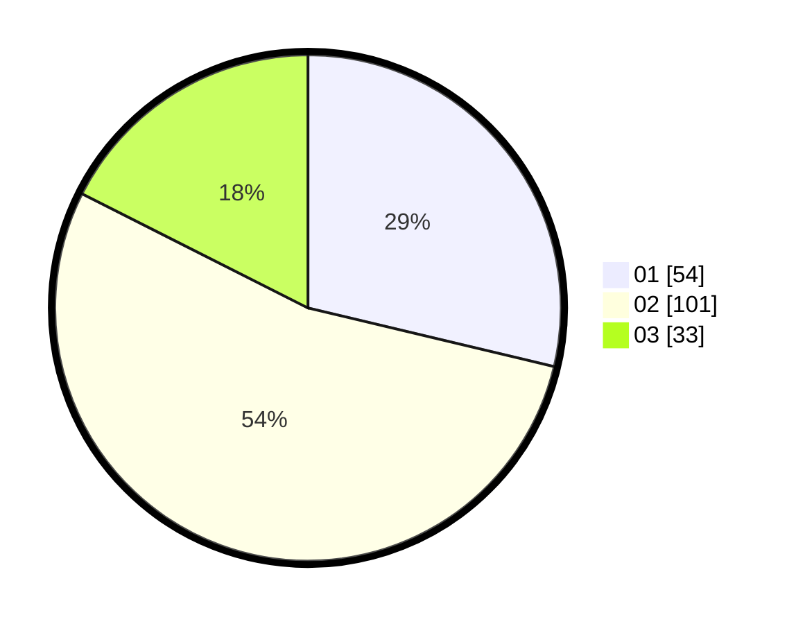

# Hasil

Hasil perolehan suara paslon dapat dilihat pada file paslon-01.txt, paslon-02.txt, dan paslon-03.txt.

Jika tidak ada, artinya data tersebut belum ada pada SIREKAP.

## Perolehan Suara

 * Paslon 01: **54**.
 * Paslon 02: **101**.
 * Paslon 03: **33**.

## Foto C Plano

https://sirekap-obj-formc.kpu.go.id/cef4/pemilu/ppwp/31/71/02/10/02/3171021002018-20240216-142512--9f3c915a-a7ca-404a-9781-41554108d4a2.jpg

https://sirekap-obj-formc.kpu.go.id/cef4/pemilu/ppwp/31/71/02/10/02/3171021002018-20240216-142514--22d3430c-e44e-4545-8207-98094ff52d27.jpg

https://sirekap-obj-formc.kpu.go.id/cef4/pemilu/ppwp/31/71/02/10/02/3171021002018-20240216-142513--3f1a3300-5781-4a11-a401-f239c8d6fee0.jpg

## DATA PEMILIH TETAP

Jumlah pemilih dalam DPT: **280**.
 * L: **142**.
 * P: **138**.

## DATA PENGGUNA HAK PILIH

Jumlah pengguna hak pilih dalam DPT: **189**.
 * L: **93**.
 * P: **96**.

Jumlah pengguna hak pilih dalam DPTb: **3**.
 * L: **1**.
 * P: **2**.

Jumlah pengguna hak pilih dalam DPK: **1**.
 * L: **1**.
 * P: **0**.

Jumlah pengguna hak pilih: **193**.
 * L: **95**.
 * P: **98**.

## JUMLAH SUARA SAH DAN TIDAK SAH

JUMLAH SELURUH SUARA SAH: **188**.

JUMLAH SUARA TIDAK SAH: **5**.

JUMLAH SELURUH SUARA SAH DAN SUARA TIDAK SAH: **193**.
