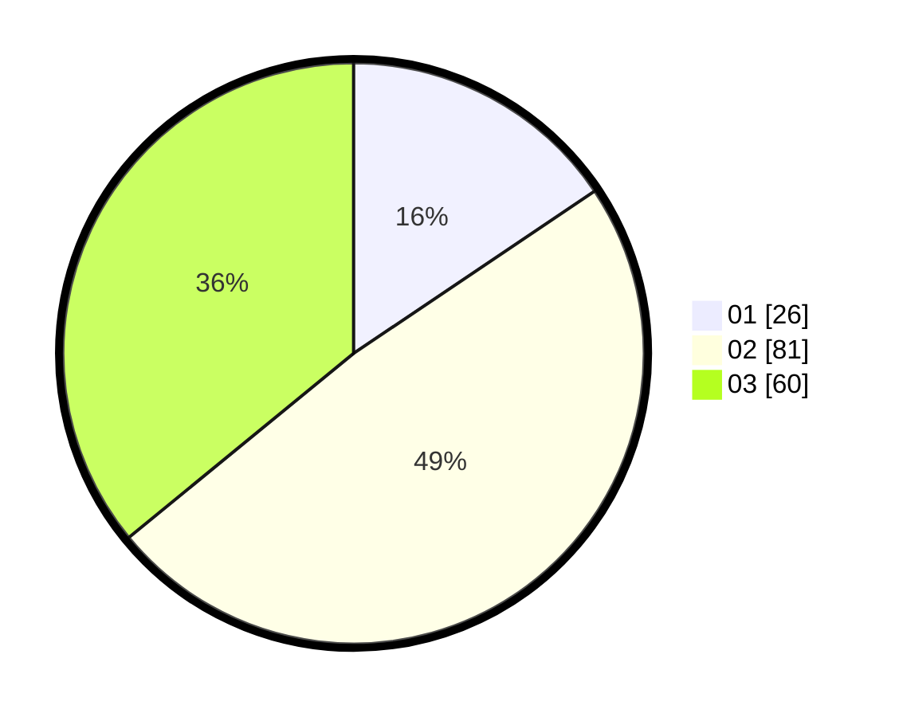

# Hasil

Hasil perolehan suara paslon dapat dilihat pada file paslon-01.txt, paslon-02.txt, dan paslon-03.txt.

Jika tidak ada, artinya data tersebut belum ada pada SIREKAP.

## Perolehan Suara

 * Paslon 01: **26**.
 * Paslon 02: **81**.
 * Paslon 03: **60**.

## Foto C Plano

https://sirekap-obj-formc.kpu.go.id/da33/pemilu/ppwp/31/71/02/10/02/3171021002020-20240216-030504--f99a41ad-efbb-49e0-bd58-2638696e4188.jpg

https://sirekap-obj-formc.kpu.go.id/da33/pemilu/ppwp/31/71/02/10/02/3171021002020-20240216-030522--70157eb5-298d-4cae-9a6d-bcb5d068ac78.jpg

https://sirekap-obj-formc.kpu.go.id/da33/pemilu/ppwp/31/71/02/10/02/3171021002020-20240216-030512--aa77da53-04c1-431a-9853-e2475bb5f710.jpg

## DATA PEMILIH TETAP

Jumlah pemilih dalam DPT: **230**.
 * L: **106**.
 * P: **124**.

## DATA PENGGUNA HAK PILIH

Jumlah pengguna hak pilih dalam DPT: **166**.
 * L: **79**.
 * P: **87**.

Jumlah pengguna hak pilih dalam DPTb: **2**.
 * L: **1**.
 * P: **1**.

Jumlah pengguna hak pilih dalam DPK: **1**.
 * L: **0**.
 * P: **1**.

Jumlah pengguna hak pilih: **169**.
 * L: **80**.
 * P: **89**.

## JUMLAH SUARA SAH DAN TIDAK SAH

JUMLAH SELURUH SUARA SAH: **167**.

JUMLAH SUARA TIDAK SAH: **2**.

JUMLAH SELURUH SUARA SAH DAN SUARA TIDAK SAH: **169**.
