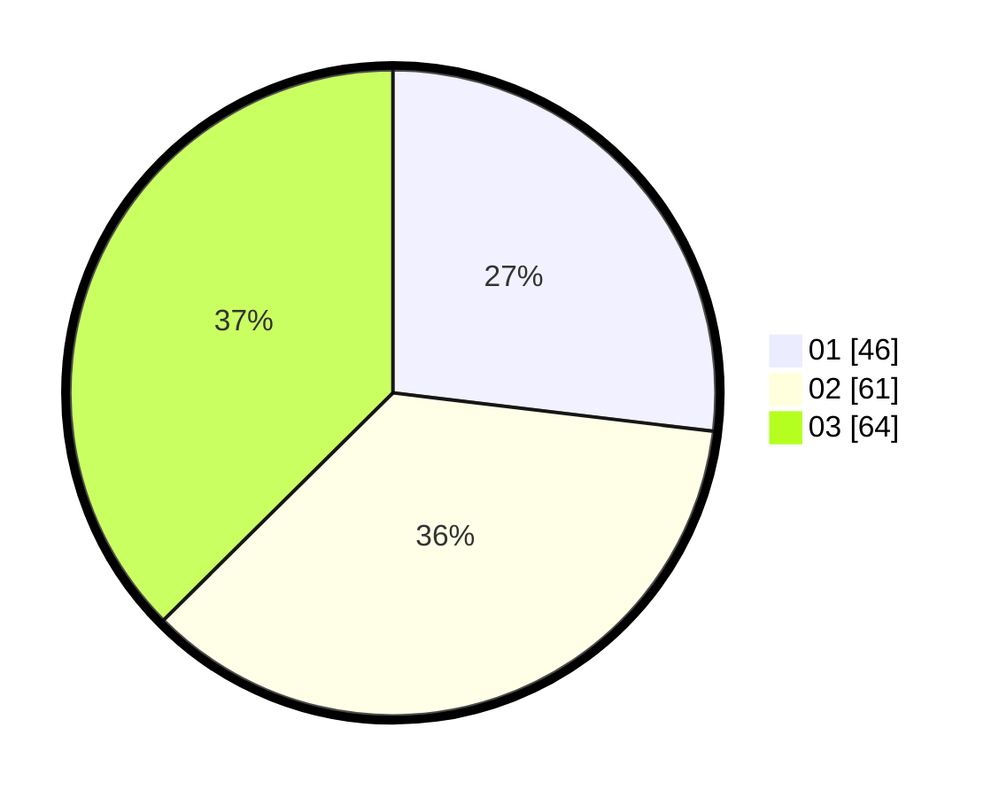

# Hasil

Hasil perolehan suara paslon dapat dilihat pada file paslon-01.txt, paslon-02.txt, dan paslon-03.txt.

Jika tidak ada, artinya data tersebut belum ada pada SIREKAP.

## Perolehan Suara

 * Paslon 01: **46**.
 * Paslon 02: **61**.
 * Paslon 03: **64**.

## Foto C Plano

https://sirekap-obj-formc.kpu.go.id/7ede/pemilu/ppwp/31/71/02/10/02/3171021002022-20240216-135728--989699ec-9753-436f-b5c5-42eb4a7d3d01.jpg

https://sirekap-obj-formc.kpu.go.id/7ede/pemilu/ppwp/31/71/02/10/02/3171021002022-20240216-135729--098ac026-41c0-4b9c-b052-8e5a2101cd18.jpg

https://sirekap-obj-formc.kpu.go.id/7ede/pemilu/ppwp/31/71/02/10/02/3171021002022-20240216-135728--ab566387-1a83-49af-a5aa-57bad32aabdc.jpg

## DATA PEMILIH TETAP

Jumlah pemilih dalam DPT: **257**.
 * L: **121**.
 * P: **136**.

## DATA PENGGUNA HAK PILIH

Jumlah pengguna hak pilih dalam DPT: **174**.
 * L: **79**.
 * P: **95**.

Jumlah pengguna hak pilih dalam DPTb: **0**.
 * L: **0**.
 * P: **0**.

Jumlah pengguna hak pilih dalam DPK: **0**.
 * L: **0**.
 * P: **0**.

Jumlah pengguna hak pilih: **174**.
 * L: **79**.
 * P: **95**.

## JUMLAH SUARA SAH DAN TIDAK SAH

JUMLAH SELURUH SUARA SAH: **171**.

JUMLAH SUARA TIDAK SAH: **3**.

JUMLAH SELURUH SUARA SAH DAN SUARA TIDAK SAH: **174**.
