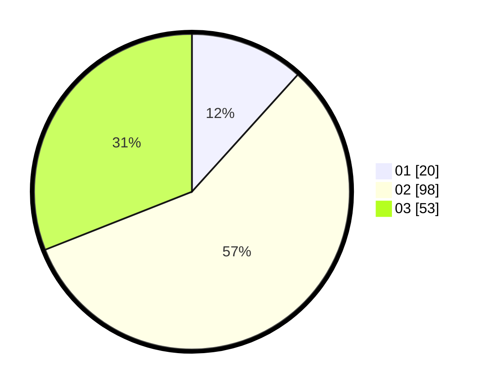

# Hasil

Hasil perolehan suara paslon dapat dilihat pada file paslon-01.txt, paslon-02.txt, dan paslon-03.txt.

Jika tidak ada, artinya data tersebut belum ada pada SIREKAP.

## Perolehan Suara

 * Paslon 01: **20**.
 * Paslon 02: **98**.
 * Paslon 03: **53**.

## Foto C Plano

https://sirekap-obj-formc.kpu.go.id/93af/pemilu/ppwp/31/71/02/10/02/3171021002025-20240216-054213--f86694a3-ea7c-4738-9533-3aaedc04c36b.jpg

https://sirekap-obj-formc.kpu.go.id/93af/pemilu/ppwp/31/71/02/10/02/3171021002025-20240216-054216--2afcc86d-ea9c-4175-8fa8-2295dec97ef1.jpg

https://sirekap-obj-formc.kpu.go.id/93af/pemilu/ppwp/31/71/02/10/02/3171021002025-20240216-054214--1eb3deb9-18a7-4f4e-815d-71aab4122000.jpg

## DATA PEMILIH TETAP

Jumlah pemilih dalam DPT: **241**.
 * L: **107**.
 * P: **134**.

## DATA PENGGUNA HAK PILIH

Jumlah pengguna hak pilih dalam DPT: **165**.
 * L: **71**.
 * P: **94**.

Jumlah pengguna hak pilih dalam DPTb: **6**.
 * L: **4**.
 * P: **2**.

Jumlah pengguna hak pilih dalam DPK: **1**.
 * L: **1**.
 * P: **0**.

Jumlah pengguna hak pilih: **172**.
 * L: **76**.
 * P: **96**.

## JUMLAH SUARA SAH DAN TIDAK SAH

JUMLAH SELURUH SUARA SAH: **171**.

JUMLAH SUARA TIDAK SAH: **1**.

JUMLAH SELURUH SUARA SAH DAN SUARA TIDAK SAH: **172**.
