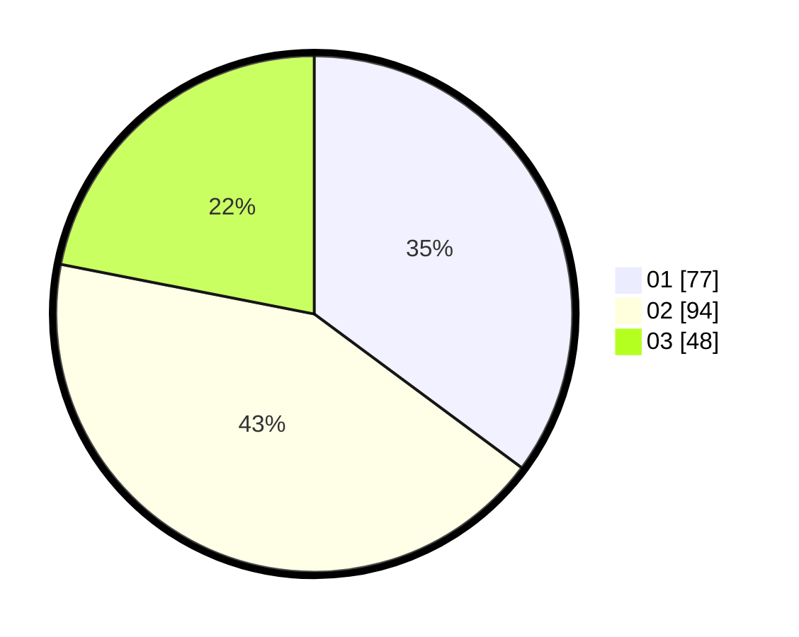

# Hasil

Hasil perolehan suara paslon dapat dilihat pada file paslon-01.txt, paslon-02.txt, dan paslon-03.txt.

Jika tidak ada, artinya data tersebut belum ada pada SIREKAP.

## Perolehan Suara

 * Paslon 01: **77**.
 * Paslon 02: **94**.
 * Paslon 03: **48**.

## Foto C Plano

https://sirekap-obj-formc.kpu.go.id/e7b1/pemilu/ppwp/31/71/02/10/02/3171021002026-20240216-163042--f35a9e78-69d2-4a80-85c5-80c065a01a90.jpg
