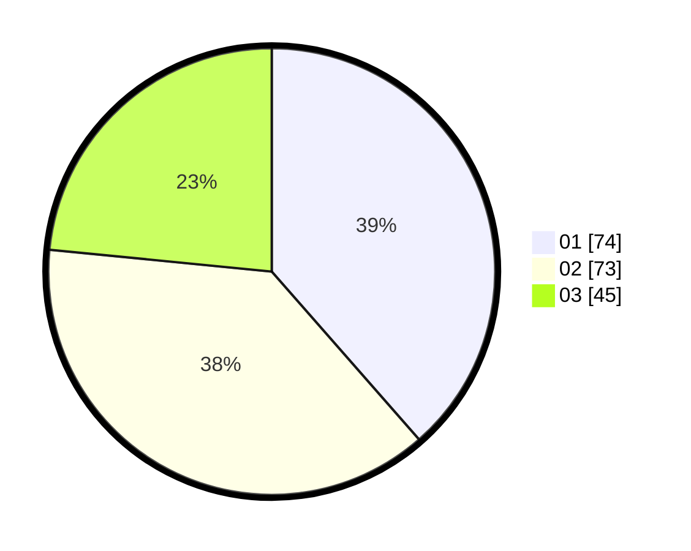

# Hasil

Hasil perolehan suara paslon dapat dilihat pada file paslon-01.txt, paslon-02.txt, dan paslon-03.txt.

Jika tidak ada, artinya data tersebut belum ada pada SIREKAP.

## Perolehan Suara

 * Paslon 01: **74**.
 * Paslon 02: **73**.
 * Paslon 03: **45**.

## Foto C Plano

https://sirekap-obj-formc.kpu.go.id/bfb6/pemilu/ppwp/31/71/02/10/02/3171021002027-20240216-143925--353cfeb7-8b73-46c3-ac39-7617318a7f73.jpg

https://sirekap-obj-formc.kpu.go.id/bfb6/pemilu/ppwp/31/71/02/10/02/3171021002027-20240216-143927--8e44bb5c-21ca-4c56-b743-49aaf64f9986.jpg

https://sirekap-obj-formc.kpu.go.id/bfb6/pemilu/ppwp/31/71/02/10/02/3171021002027-20240216-143926--51cad0df-27ad-4bbd-bf9b-80747181d6de.jpg

## DATA PEMILIH TETAP

Jumlah pemilih dalam DPT: **267**.
 * L: **124**.
 * P: **143**.

## DATA PENGGUNA HAK PILIH

Jumlah pengguna hak pilih dalam DPT: **194**.
 * L: **91**.
 * P: **103**.

Jumlah pengguna hak pilih dalam DPTb: **0**.
 * L: **0**.
 * P: **0**.

Jumlah pengguna hak pilih dalam DPK: **1**.
 * L: **1**.
 * P: **0**.

Jumlah pengguna hak pilih: **195**.
 * L: **92**.
 * P: **103**.

## JUMLAH SUARA SAH DAN TIDAK SAH

JUMLAH SELURUH SUARA SAH: **192**.

JUMLAH SUARA TIDAK SAH: **3**.

JUMLAH SELURUH SUARA SAH DAN SUARA TIDAK SAH: **195**.
