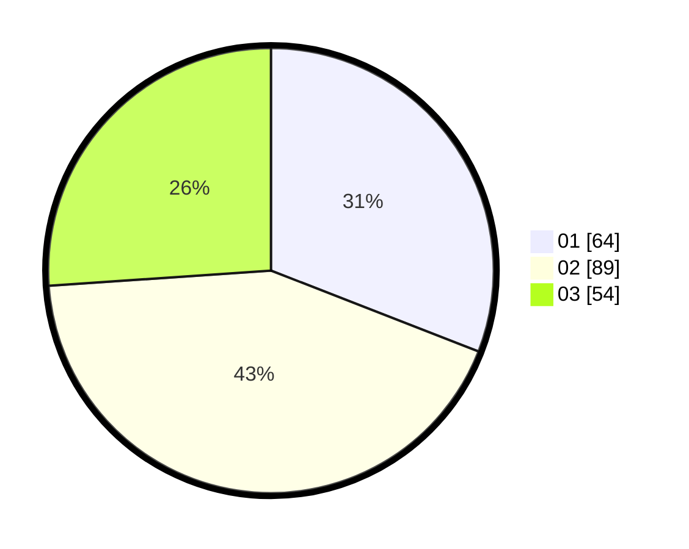

# Hasil

Hasil perolehan suara paslon dapat dilihat pada file paslon-01.txt, paslon-02.txt, dan paslon-03.txt.

Jika tidak ada, artinya data tersebut belum ada pada SIREKAP.

## Perolehan Suara

 * Paslon 01: **64**.
 * Paslon 02: **89**.
 * Paslon 03: **54**.

## Foto C Plano

https://sirekap-obj-formc.kpu.go.id/b1a1/pemilu/ppwp/31/71/02/10/02/3171021002028-20240216-212933--f6754eca-6c83-4805-aaa6-eed89da551c0.jpg

https://sirekap-obj-formc.kpu.go.id/b1a1/pemilu/ppwp/31/71/02/10/02/3171021002028-20240216-212934--877595c9-eb1e-4686-bc20-fa88f59920c9.jpg

https://sirekap-obj-formc.kpu.go.id/b1a1/pemilu/ppwp/31/71/02/10/02/3171021002028-20240216-212933--c926efb7-6446-43a3-879e-f86bccd650b0.jpg

## DATA PEMILIH TETAP

Jumlah pemilih dalam DPT: **294**.
 * L: **133**.
 * P: **161**.

## DATA PENGGUNA HAK PILIH

Jumlah pengguna hak pilih dalam DPT: **207**.
 * L: **114**.
 * P: **93**.

Jumlah pengguna hak pilih dalam DPTb: **4**.
 * L: **3**.
 * P: **1**.

Jumlah pengguna hak pilih dalam DPK: **0**.
 * L: **0**.
 * P: **0**.

Jumlah pengguna hak pilih: **211**.
 * L: **117**.
 * P: **94**.

## JUMLAH SUARA SAH DAN TIDAK SAH

JUMLAH SELURUH SUARA SAH: **207**.

JUMLAH SUARA TIDAK SAH: **4**.

JUMLAH SELURUH SUARA SAH DAN SUARA TIDAK SAH: **211**.
