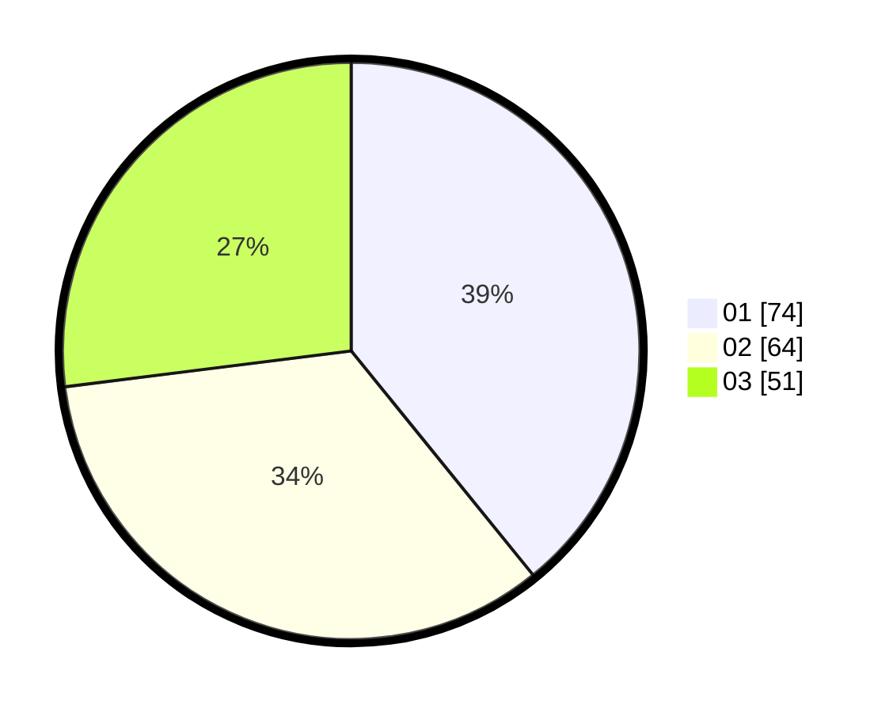

# Hasil

Hasil perolehan suara paslon dapat dilihat pada file paslon-01.txt, paslon-02.txt, dan paslon-03.txt.

Jika tidak ada, artinya data tersebut belum ada pada SIREKAP.

## Perolehan Suara

 * Paslon 01: **74**.
 * Paslon 02: **64**.
 * Paslon 03: **51**.

## Foto C Plano

https://sirekap-obj-formc.kpu.go.id/f769/pemilu/ppwp/31/71/02/10/02/3171021002032-20240216-135532--fb29fe7c-fd36-4415-984e-c30f04bd28ed.jpg

https://sirekap-obj-formc.kpu.go.id/f769/pemilu/ppwp/31/71/02/10/02/3171021002032-20240216-135533--a182a547-bb70-4f71-841e-7d06f8139496.jpg

https://sirekap-obj-formc.kpu.go.id/f769/pemilu/ppwp/31/71/02/10/02/3171021002032-20240216-135532--4b4958b0-6e6f-4df6-975c-1d40cd563300.jpg

## DATA PEMILIH TETAP

Jumlah pemilih dalam DPT: **283**.
 * L: **133**.
 * P: **150**.

## DATA PENGGUNA HAK PILIH

Jumlah pengguna hak pilih dalam DPT: **196**.
 * L: **91**.
 * P: **105**.

Jumlah pengguna hak pilih dalam DPTb: **1**.
 * L: **0**.
 * P: **1**.

Jumlah pengguna hak pilih dalam DPK: **0**.
 * L: **0**.
 * P: **0**.

Jumlah pengguna hak pilih: **197**.
 * L: **91**.
 * P: **106**.

## JUMLAH SUARA SAH DAN TIDAK SAH

JUMLAH SELURUH SUARA SAH: **189**.

JUMLAH SUARA TIDAK SAH: **8**.

JUMLAH SELURUH SUARA SAH DAN SUARA TIDAK SAH: **197**.
