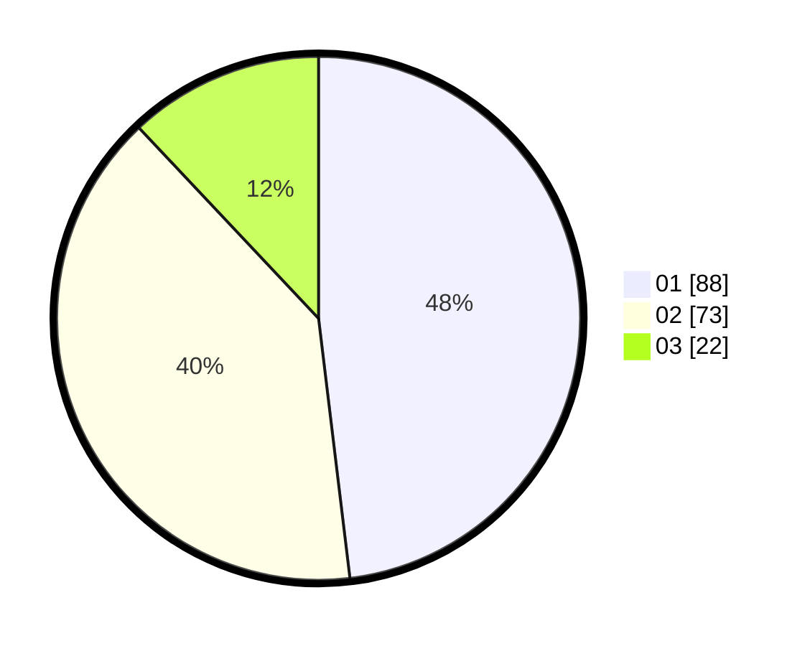

# Hasil

Hasil perolehan suara paslon dapat dilihat pada file paslon-01.txt, paslon-02.txt, dan paslon-03.txt.

Jika tidak ada, artinya data tersebut belum ada pada SIREKAP.

## Perolehan Suara

 * Paslon 01: **88**.
 * Paslon 02: **73**.
 * Paslon 03: **22**.

## Foto C Plano

https://sirekap-obj-formc.kpu.go.id/29a8/pemilu/ppwp/31/71/02/10/02/3171021002034-20240216-142419--bff82ef2-3fa4-460d-9ae8-32732ecf74ca.jpg

https://sirekap-obj-formc.kpu.go.id/29a8/pemilu/ppwp/31/71/02/10/02/3171021002034-20240216-142420--60ee3ef9-5257-44ce-9c8f-378b4b961a9b.jpg

https://sirekap-obj-formc.kpu.go.id/29a8/pemilu/ppwp/31/71/02/10/02/3171021002034-20240216-142419--e0681972-97c4-40c8-8906-84c6af65e297.jpg

## DATA PEMILIH TETAP

Jumlah pemilih dalam DPT: **265**.
 * L: **126**.
 * P: **139**.

## DATA PENGGUNA HAK PILIH

Jumlah pengguna hak pilih dalam DPT: **180**.
 * L: **88**.
 * P: **92**.

Jumlah pengguna hak pilih dalam DPTb: **2**.
 * L: **2**.
 * P: **0**.

Jumlah pengguna hak pilih dalam DPK: **1**.
 * L: **1**.
 * P: **0**.

Jumlah pengguna hak pilih: **183**.
 * L: **91**.
 * P: **92**.

## JUMLAH SUARA SAH DAN TIDAK SAH

JUMLAH SELURUH SUARA SAH: **183**.

JUMLAH SUARA TIDAK SAH: **0**.

JUMLAH SELURUH SUARA SAH DAN SUARA TIDAK SAH: **183**.
