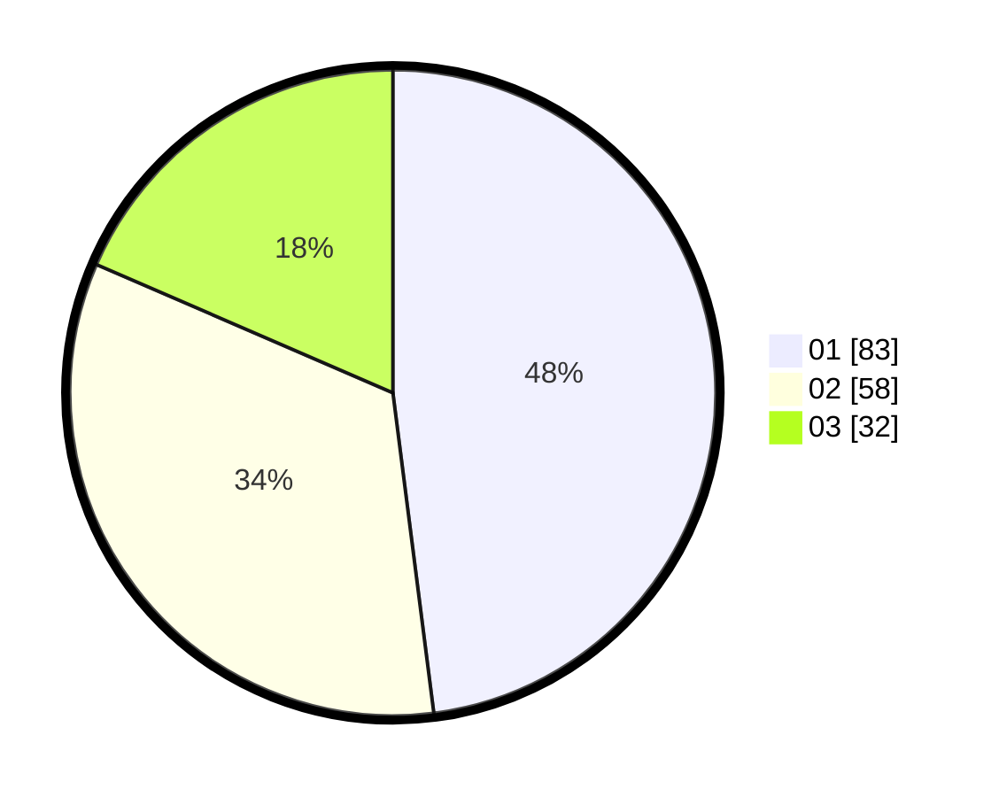

# Hasil

Hasil perolehan suara paslon dapat dilihat pada file paslon-01.txt, paslon-02.txt, dan paslon-03.txt.

Jika tidak ada, artinya data tersebut belum ada pada SIREKAP.

## Perolehan Suara

 * Paslon 01: **83**.
 * Paslon 02: **58**.
 * Paslon 03: **32**.

## Foto C Plano

https://sirekap-obj-formc.kpu.go.id/da92/pemilu/ppwp/31/71/02/10/02/3171021002035-20240216-134221--cd39faa5-f2fa-462f-a160-79ee66a40fa0.jpg

https://sirekap-obj-formc.kpu.go.id/da92/pemilu/ppwp/31/71/02/10/02/3171021002035-20240216-134222--bf5a216d-09c6-4b06-aded-6519b83fde85.jpg

https://sirekap-obj-formc.kpu.go.id/da92/pemilu/ppwp/31/71/02/10/02/3171021002035-20240216-134221--0b9cf7c5-8e0f-42dc-b296-e77e026f0dae.jpg

## DATA PEMILIH TETAP

Jumlah pemilih dalam DPT: **249**.
 * L: **130**.
 * P: **119**.

## DATA PENGGUNA HAK PILIH

Jumlah pengguna hak pilih dalam DPT: **173**.
 * L: **84**.
 * P: **89**.

Jumlah pengguna hak pilih dalam DPTb: **0**.
 * L: **0**.
 * P: **0**.

Jumlah pengguna hak pilih dalam DPK: **0**.
 * L: **0**.
 * P: **0**.

Jumlah pengguna hak pilih: **173**.
 * L: **84**.
 * P: **89**.

## JUMLAH SUARA SAH DAN TIDAK SAH

JUMLAH SELURUH SUARA SAH: **173**.

JUMLAH SUARA TIDAK SAH: **0**.

JUMLAH SELURUH SUARA SAH DAN SUARA TIDAK SAH: **173**.
