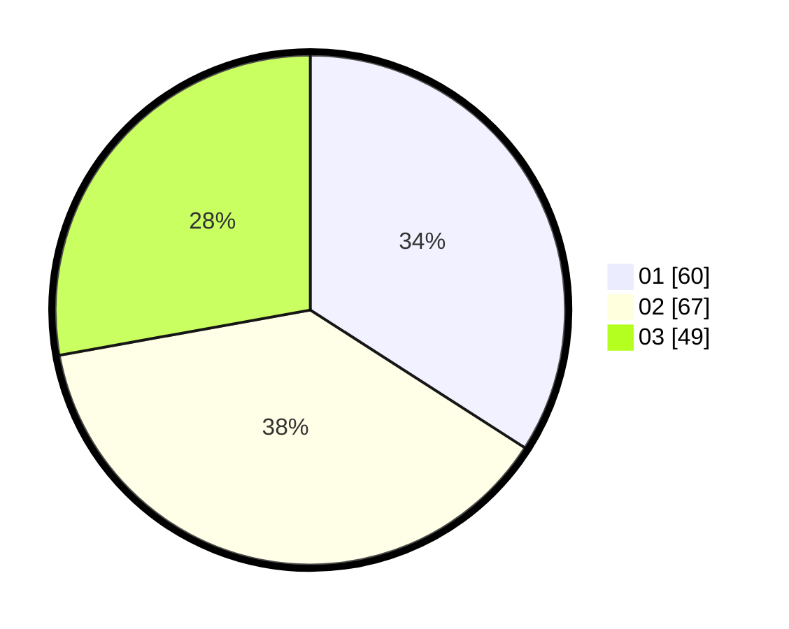

# Hasil

Hasil perolehan suara paslon dapat dilihat pada file paslon-01.txt, paslon-02.txt, dan paslon-03.txt.

Jika tidak ada, artinya data tersebut belum ada pada SIREKAP.

## Perolehan Suara

 * Paslon 01: **60**.
 * Paslon 02: **67**.
 * Paslon 03: **49**.

## Foto C Plano

https://sirekap-obj-formc.kpu.go.id/ee2c/pemilu/ppwp/31/71/02/10/02/3171021002036-20240217-110038--ae44fb9f-ffdb-4b6e-bb92-2460bec9e70d.jpg

https://sirekap-obj-formc.kpu.go.id/ee2c/pemilu/ppwp/31/71/02/10/02/3171021002036-20240217-110040--425fa6ad-b3bb-4c34-a13b-f7ad60937f3b.jpg

https://sirekap-obj-formc.kpu.go.id/ee2c/pemilu/ppwp/31/71/02/10/02/3171021002036-20240217-110039--d3aa36d1-da5e-47eb-bbe8-022fea737f65.jpg

## DATA PEMILIH TETAP

Jumlah pemilih dalam DPT: **260**.
 * L: **125**.
 * P: **135**.

## DATA PENGGUNA HAK PILIH

Jumlah pengguna hak pilih dalam DPT: **177**.
 * L: **86**.
 * P: **91**.

Jumlah pengguna hak pilih dalam DPTb: **0**.
 * L: **0**.
 * P: **0**.

Jumlah pengguna hak pilih dalam DPK: **0**.
 * L: **0**.
 * P: **0**.

Jumlah pengguna hak pilih: **177**.
 * L: **86**.
 * P: **91**.

## JUMLAH SUARA SAH DAN TIDAK SAH

JUMLAH SELURUH SUARA SAH: **176**.

JUMLAH SUARA TIDAK SAH: **1**.

JUMLAH SELURUH SUARA SAH DAN SUARA TIDAK SAH: **177**.
