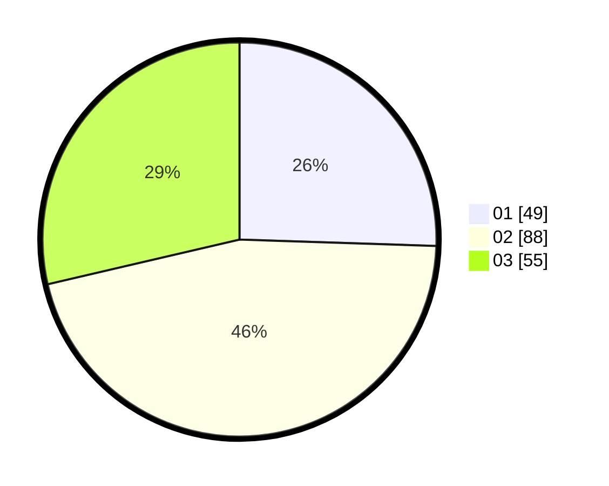

# Hasil

Hasil perolehan suara paslon dapat dilihat pada file paslon-01.txt, paslon-02.txt, dan paslon-03.txt.

Jika tidak ada, artinya data tersebut belum ada pada SIREKAP.

## Perolehan Suara

 * Paslon 01: **49**.
 * Paslon 02: **88**.
 * Paslon 03: **55**.

## Foto C Plano

https://sirekap-obj-formc.kpu.go.id/55a6/pemilu/ppwp/31/71/02/10/02/3171021002039-20240216-132553--8210bad6-6a76-409d-87b7-f9c0282776e9.jpg

https://sirekap-obj-formc.kpu.go.id/55a6/pemilu/ppwp/31/71/02/10/02/3171021002039-20240216-132554--e849b108-95c8-4a3e-9425-a70fd9eba3c6.jpg

https://sirekap-obj-formc.kpu.go.id/55a6/pemilu/ppwp/31/71/02/10/02/3171021002039-20240216-132553--7f1c9431-065f-441d-846f-3895143130da.jpg

## DATA PEMILIH TETAP

Jumlah pemilih dalam DPT: **257**.
 * L: **121**.
 * P: **136**.

## DATA PENGGUNA HAK PILIH

Jumlah pengguna hak pilih dalam DPT: **188**.
 * L: **86**.
 * P: **102**.

Jumlah pengguna hak pilih dalam DPTb: **2**.
 * L: **0**.
 * P: **2**.

Jumlah pengguna hak pilih dalam DPK: **2**.
 * L: **1**.
 * P: **1**.

Jumlah pengguna hak pilih: **192**.
 * L: **87**.
 * P: **105**.

## JUMLAH SUARA SAH DAN TIDAK SAH

JUMLAH SELURUH SUARA SAH: **192**.

JUMLAH SUARA TIDAK SAH: **0**.

JUMLAH SELURUH SUARA SAH DAN SUARA TIDAK SAH: **192**.
