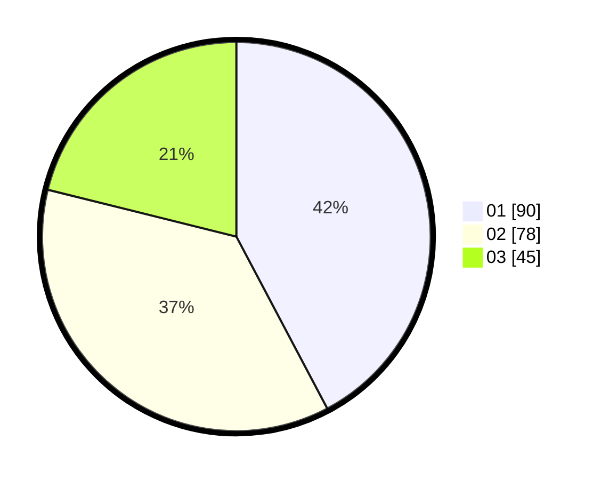

# Hasil

Hasil perolehan suara paslon dapat dilihat pada file paslon-01.txt, paslon-02.txt, dan paslon-03.txt.

Jika tidak ada, artinya data tersebut belum ada pada SIREKAP.

## Perolehan Suara

 * Paslon 01: **90**.
 * Paslon 02: **78**.
 * Paslon 03: **45**.

## Foto C Plano

https://sirekap-obj-formc.kpu.go.id/0982/pemilu/ppwp/31/71/02/10/02/3171021002040-20240216-094733--016b672a-0768-4c79-9dde-9f6bd55146fd.jpg

https://sirekap-obj-formc.kpu.go.id/0982/pemilu/ppwp/31/71/02/10/02/3171021002040-20240216-094740--2b0adbdd-9fd6-41ea-955a-a1b6eb621578.jpg

https://sirekap-obj-formc.kpu.go.id/0982/pemilu/ppwp/31/71/02/10/02/3171021002040-20240216-094736--3a4712c4-730f-4129-a626-1373f14b077d.jpg

## DATA PEMILIH TETAP

Jumlah pemilih dalam DPT: **271**.
 * L: **134**.
 * P: **137**.

## DATA PENGGUNA HAK PILIH

Jumlah pengguna hak pilih dalam DPT: **211**.
 * L: **98**.
 * P: **113**.

Jumlah pengguna hak pilih dalam DPTb: **1**.
 * L: **0**.
 * P: **1**.

Jumlah pengguna hak pilih dalam DPK: **3**.
 * L: **0**.
 * P: **3**.

Jumlah pengguna hak pilih: **215**.
 * L: **98**.
 * P: **117**.

## JUMLAH SUARA SAH DAN TIDAK SAH

JUMLAH SELURUH SUARA SAH: **213**.

JUMLAH SUARA TIDAK SAH: **2**.

JUMLAH SELURUH SUARA SAH DAN SUARA TIDAK SAH: **215**.
