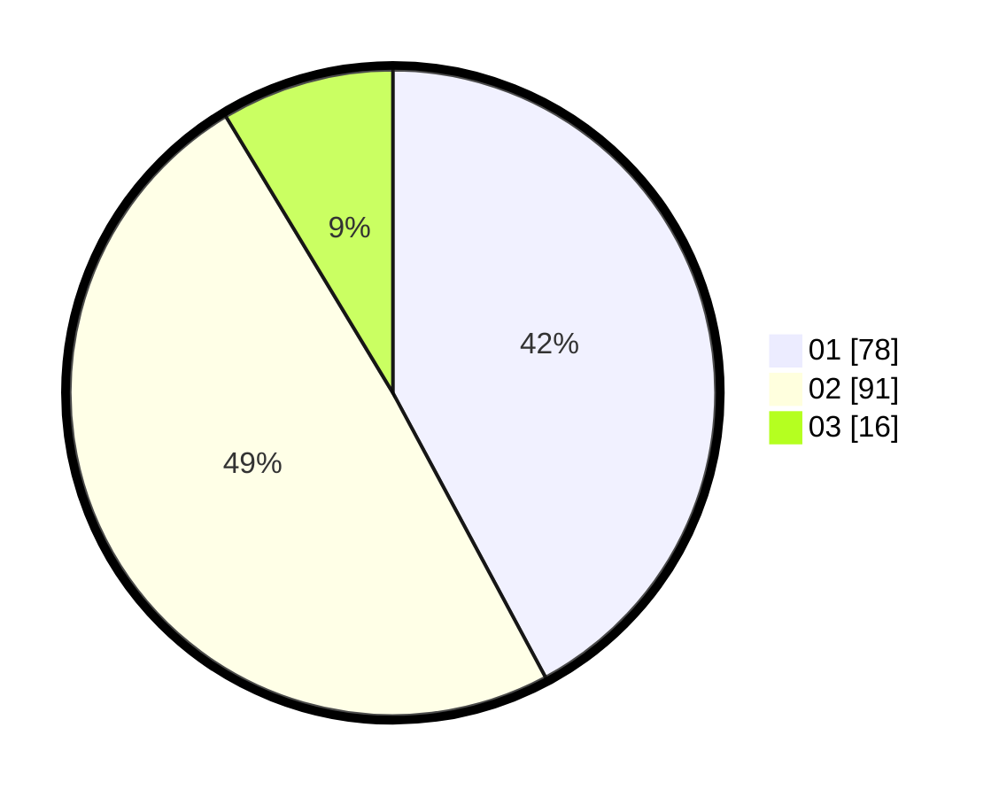

# Hasil

Hasil perolehan suara paslon dapat dilihat pada file paslon-01.txt, paslon-02.txt, dan paslon-03.txt.

Jika tidak ada, artinya data tersebut belum ada pada SIREKAP.

## Perolehan Suara

 * Paslon 01: **78**.
 * Paslon 02: **91**.
 * Paslon 03: **16**.

## Foto C Plano

https://sirekap-obj-formc.kpu.go.id/0d75/pemilu/ppwp/31/71/02/10/02/3171021002044-20240217-170039--0a492c93-5a09-4213-88ca-2de774b0df64.jpg

https://sirekap-obj-formc.kpu.go.id/0d75/pemilu/ppwp/31/71/02/10/02/3171021002044-20240217-170041--18cd3723-5352-4516-a50b-074b1c57f166.jpg

https://sirekap-obj-formc.kpu.go.id/0d75/pemilu/ppwp/31/71/02/10/02/3171021002044-20240217-170040--90cb3136-0a27-47a4-81d7-6ae0de5eb7e9.jpg

## DATA PEMILIH TETAP

Jumlah pemilih dalam DPT: **269**.
 * L: **138**.
 * P: **131**.

## DATA PENGGUNA HAK PILIH

Jumlah pengguna hak pilih dalam DPT: **183**.
 * L: **92**.
 * P: **91**.

Jumlah pengguna hak pilih dalam DPTb: **4**.
 * L: **3**.
 * P: **1**.

Jumlah pengguna hak pilih dalam DPK: **0**.
 * L: **0**.
 * P: **0**.

Jumlah pengguna hak pilih: **187**.
 * L: **95**.
 * P: **92**.

## JUMLAH SUARA SAH DAN TIDAK SAH

JUMLAH SELURUH SUARA SAH: **185**.

JUMLAH SUARA TIDAK SAH: **2**.

JUMLAH SELURUH SUARA SAH DAN SUARA TIDAK SAH: **187**.
