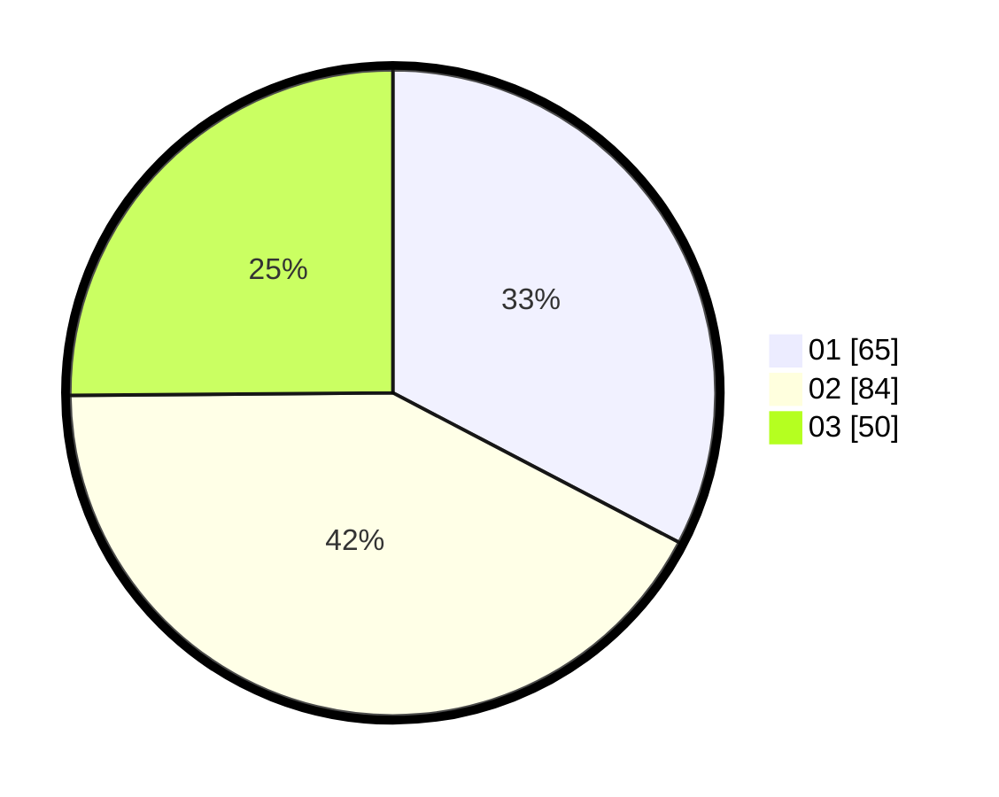

# Hasil

Hasil perolehan suara paslon dapat dilihat pada file paslon-01.txt, paslon-02.txt, dan paslon-03.txt.

Jika tidak ada, artinya data tersebut belum ada pada SIREKAP.

## Perolehan Suara

 * Paslon 01: **65**.
 * Paslon 02: **84**.
 * Paslon 03: **50**.

## Foto C Plano

https://sirekap-obj-formc.kpu.go.id/b08f/pemilu/ppwp/31/71/02/10/02/3171021002047-20240216-142414--ba3cc9e2-fb23-4d98-a54a-0320cd909467.jpg

https://sirekap-obj-formc.kpu.go.id/b08f/pemilu/ppwp/31/71/02/10/02/3171021002047-20240216-142416--72791f95-24fd-419c-a966-ed647d928809.jpg

https://sirekap-obj-formc.kpu.go.id/b08f/pemilu/ppwp/31/71/02/10/02/3171021002047-20240216-142415--3b1a5704-84d2-4f50-9ef1-4d9ff8b2998a.jpg

## DATA PEMILIH TETAP

Jumlah pemilih dalam DPT: **274**.
 * L: **135**.
 * P: **139**.

## DATA PENGGUNA HAK PILIH

Jumlah pengguna hak pilih dalam DPT: **195**.
 * L: **97**.
 * P: **98**.

Jumlah pengguna hak pilih dalam DPTb: **3**.
 * L: **3**.
 * P: **0**.

Jumlah pengguna hak pilih dalam DPK: **1**.
 * L: **1**.
 * P: **0**.

Jumlah pengguna hak pilih: **199**.
 * L: **101**.
 * P: **98**.

## JUMLAH SUARA SAH DAN TIDAK SAH

JUMLAH SELURUH SUARA SAH: **199**.

JUMLAH SUARA TIDAK SAH: **0**.

JUMLAH SELURUH SUARA SAH DAN SUARA TIDAK SAH: **199**.
