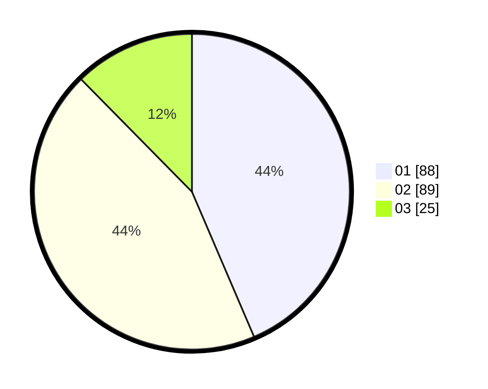

# Hasil

Hasil perolehan suara paslon dapat dilihat pada file paslon-01.txt, paslon-02.txt, dan paslon-03.txt.

Jika tidak ada, artinya data tersebut belum ada pada SIREKAP.

## Perolehan Suara

 * Paslon 01: **88**.
 * Paslon 02: **89**.
 * Paslon 03: **25**.

## Foto C Plano

https://sirekap-obj-formc.kpu.go.id/d46a/pemilu/ppwp/31/71/02/10/02/3171021002048-20240216-155350--c0ef26d3-6151-4597-adba-db2803ba118c.jpg

https://sirekap-obj-formc.kpu.go.id/d46a/pemilu/ppwp/31/71/02/10/02/3171021002048-20240216-155351--a29e4e04-bf70-4eba-bd07-ae5f16fc9534.jpg

https://sirekap-obj-formc.kpu.go.id/d46a/pemilu/ppwp/31/71/02/10/02/3171021002048-20240216-155351--85f1cc23-c7db-4e38-9d0a-22d608e0e05c.jpg

## DATA PEMILIH TETAP

Jumlah pemilih dalam DPT: **269**.
 * L: **132**.
 * P: **137**.

## DATA PENGGUNA HAK PILIH

Jumlah pengguna hak pilih dalam DPT: **198**.
 * L: **90**.
 * P: **108**.

Jumlah pengguna hak pilih dalam DPTb: **5**.
 * L: **3**.
 * P: **2**.

Jumlah pengguna hak pilih dalam DPK: **0**.
 * L: **0**.
 * P: **0**.

Jumlah pengguna hak pilih: **203**.
 * L: **93**.
 * P: **110**.

## JUMLAH SUARA SAH DAN TIDAK SAH

JUMLAH SELURUH SUARA SAH: **202**.

JUMLAH SUARA TIDAK SAH: **1**.

JUMLAH SELURUH SUARA SAH DAN SUARA TIDAK SAH: **203**.
