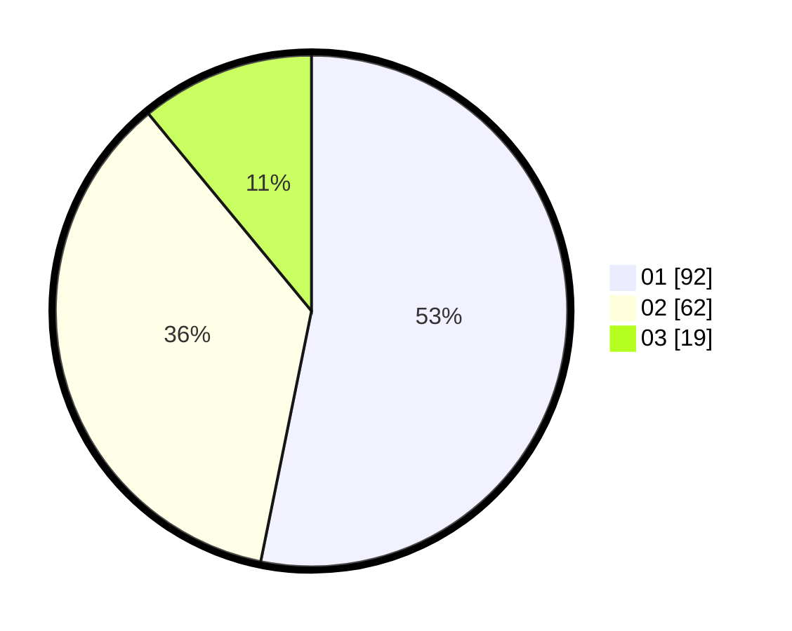

# Hasil

Hasil perolehan suara paslon dapat dilihat pada file paslon-01.txt, paslon-02.txt, dan paslon-03.txt.

Jika tidak ada, artinya data tersebut belum ada pada SIREKAP.

## Perolehan Suara

 * Paslon 01: **92**.
 * Paslon 02: **62**.
 * Paslon 03: **19**.

## Foto C Plano

https://sirekap-obj-formc.kpu.go.id/2fa4/pemilu/ppwp/31/71/02/10/02/3171021002049-20240216-055732--34f1135d-6124-4cc4-b505-1d28d73315ff.jpg

https://sirekap-obj-formc.kpu.go.id/2fa4/pemilu/ppwp/31/71/02/10/02/3171021002049-20240216-055306--551f08cb-26bc-4001-9a8a-5fd0f187f0ae.jpg

https://sirekap-obj-formc.kpu.go.id/2fa4/pemilu/ppwp/31/71/02/10/02/3171021002049-20240216-055743--11c40ad5-35b8-47c0-bafe-9a7318da2705.jpg

## DATA PEMILIH TETAP

Jumlah pemilih dalam DPT: **262**.
 * L: **132**.
 * P: **130**.

## DATA PENGGUNA HAK PILIH

Jumlah pengguna hak pilih dalam DPT: **174**.
 * L: **86**.
 * P: **88**.

Jumlah pengguna hak pilih dalam DPTb: **1**.
 * L: **0**.
 * P: **1**.

Jumlah pengguna hak pilih dalam DPK: **1**.
 * L: **0**.
 * P: **1**.

Jumlah pengguna hak pilih: **176**.
 * L: **86**.
 * P: **90**.

## JUMLAH SUARA SAH DAN TIDAK SAH

JUMLAH SELURUH SUARA SAH: **173**.

JUMLAH SUARA TIDAK SAH: **3**.

JUMLAH SELURUH SUARA SAH DAN SUARA TIDAK SAH: **176**.
